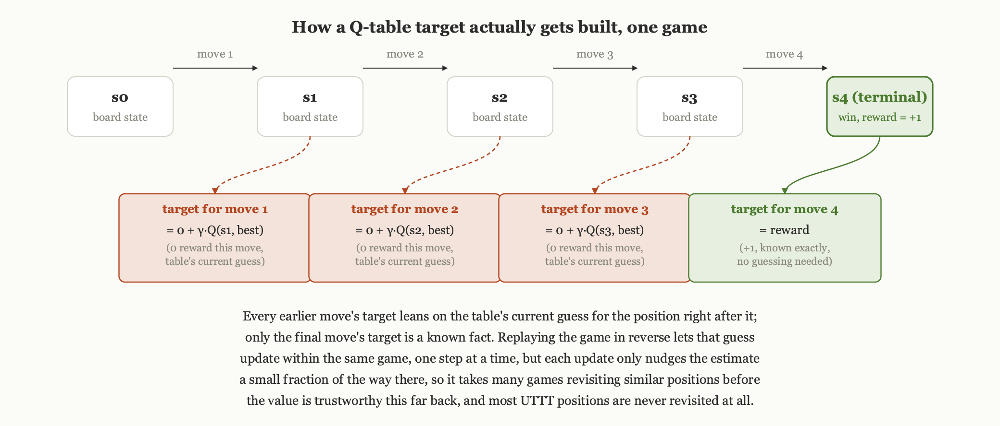
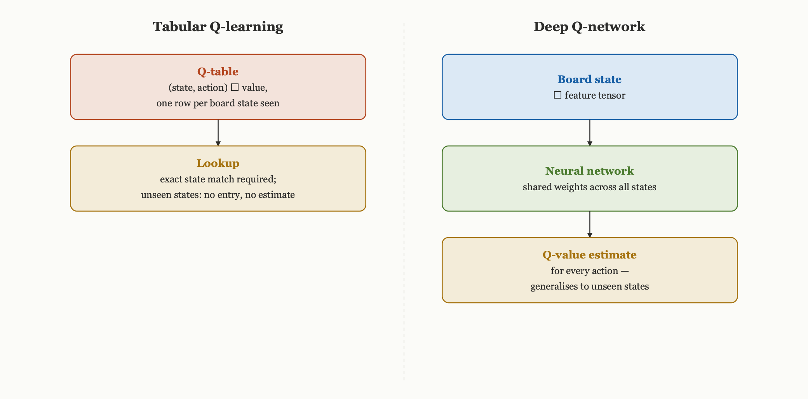
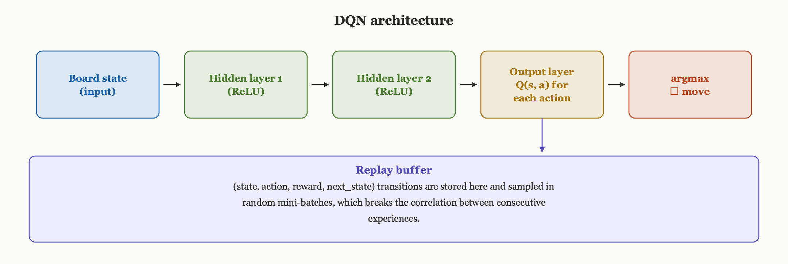

# From Zero to AlphaZero: Teaching an Agent to Play — From Q-Tables to Deep Q-Networks

*Prerequisites: [From Zero to AlphaZero: Building the Ultimate Tic-Tac-Toe Engine in Python](https://tthl.substack.com/p/building-the-ultimate-tic-tac-toe) (the game engine). You will need Python 3.9+, NumPy, and PyTorch. All code in this post builds on the `GameState`, `apply_move`, `get_legal_moves`, `encode_state`, and `get_legal_move_mask` functions from [From Zero to AlphaZero: Building the Ultimate Tic-Tac-Toe Engine in Python](https://tthl.substack.com/p/building-the-ultimate-tic-tac-toe).*

---

In our last essay, [What Is a Computational Graph, Really?](https://tthl.substack.com/p/from-zero-to-alphazero-what-is-a), we introduced PyTorch and explained how it builds a computational graph to fine-tune the parameters of a function through gradient descent on a specified loss function. With that setting the scene, we now want to address a more fundamental question: what is the loss function for evaluating a good Ultimate Tic-Tac-Toe move? This is a highly ambiguous question, because there are so many possible game states in Ultimate Tic-Tac-Toe that we cannot hand-craft a loss function for every one of them. We need a mechanism that assigns a loss to any game state, or at least to every game state our training ever covers. To find one, recall that our earlier essay on [the reinforcement learning landscape](https://tthl.substack.com/p/from-zero-to-alphazero-the-reinforcement) covered the mathematical framework behind Q-learning. Let's revisit that framework now and see how it works in practice.

**Previous posts in this series:**

- [From Zero to AlphaZero: Ultimate Tic-Tac-Toe](https://tthl.substack.com/p/from-zero-to-alphazero-ultimate-tic)
- [From Zero to AlphaZero: Building the Ultimate Tic-Tac-Toe Engine in Python](https://tthl.substack.com/p/building-the-ultimate-tic-tac-toe)
- [From Zero to AlphaZero: The Reinforcement Learning Landscape](https://tthl.substack.com/p/from-zero-to-alphazero-the-reinforcement)
- [From Zero to AlphaZero: The Explore-Exploit Trade-off — The Bandit Algorithm Behind AlphaZero](https://tthl.substack.com/p/t3-the-slot-machine-problem-where)
- [From Zero to AlphaZero: PUCT — How AlphaZero Weighs Curiosity, Evidence, and Intuition](https://tthl.substack.com/p/from-zero-to-alphazero-puct-how-alphazero)
- *From Zero to AlphaZero: What Is a Computational Graph, Really?* (link TBD)

---

## 1. Tabular Q-Learning: The State-Space Problem

Q-learning maintains a table mapping each (state, action) pair to its Q-value, the expected total future reward if that action is taken and play continues optimally afterward. On small problems, such as a 4×4 grid world or a simple maze, this works well, since the table remains finite and manageable.

UTTT is a different scale entirely. The state space runs to roughly 3^81 ≈ 4.4 × 10^38 distinct board configurations, and a Q-table with one float per entry, even if we could find somewhere to put it, would need more storage than exists on Earth.

We can still run tabular Q-learning anyway, just to see how far it gets, knowing in advance it will only ever learn from positions it has actually visited and generalise to nothing else.

Here is how a Q-value actually gets learned from played games. Play one to the end, and the last move has a target we know exactly: the actual outcome, since nothing happens after it. Every earlier move does not have that luxury at the moment it needs an update, so it bootstraps instead: the target is whatever reward that move earned, usually zero since Ultimate Tic-Tac-Toe is decided only at the end, plus the table's own current best guess for the position that move led to. The code below replays each game in reverse, last move first, so the guess it bootstraps from is often freshly updated within the same game: the table already knows the finishing move's value by the time it computes the target for the move before it. Each update only nudges the table a fraction of the way toward its target, the learning rate decides how much, so an early move's value only becomes trustworthy after many games happen to revisit the same or a similar position. In a state space of 3^81 possible boards, almost no position gets visited twice.



Concretely: for every move except the last one in a game, reward is 0, unless that particular move happens to win a sub-board, in which case it gets a small shaping bonus of 0.02, added mainly to give some signal before the game ends. Only the final move of the game gets the real outcome as its reward: +1 for a win, −1 for a loss, 0 for a draw, plus that same sub-board bonus if the winning move happened to capture one. That final-move reward is the only place a literal game outcome enters the table directly; everywhere else, the target is built from the table's own current guess.

The update above already is the loss function from the opening, just applied to the smallest possible model. Treat each table entry Q(s, a) as its own free parameter, and the update is one step of gradient descent on the squared error between that entry and its target: L = (target − Q(s, a))². The gradient of that loss with respect to the one parameter it touches is −2(target − Q(s, a)), so nudging Q(s, a) toward the target by a fraction set by the learning rate is exactly what a gradient step produces. A table entry does not depend on any other parameters, so there is nothing to run the chain rule through. Last essay's machinery becomes necessary once Q(s, a) is computed by a function with layers in between, which is exactly what the network below adds.

The implementation is a plain Python dictionary keyed by (state, action), defaulting to zero, updated with exactly the terminal-or-bootstrap rule described above, plus an epsilon-greedy rule that explores at rate ε and otherwise takes the highest-value legal move: [tabular_q/agent.py, lines 13–88](https://github.com/thltsui/RecursiveTicTacToe/blob/8e19888892029b086e01376cfbe0d4f7aaace3e4/experiments/tabular_q/agent.py#L13-L88).

### Training loop

To train, we run self-play games where one agent plays as X and a copy (or a random agent) plays as O. After each move, we compute a reward and update:

Each training game runs both players through their own agent, records the (state, move) pairs each one visited, and applies the update to every visited pair in reverse once the game ends: [tabular_q/train.py, lines 40–92](https://github.com/thltsui/RecursiveTicTacToe/blob/8e19888892029b086e01376cfbe0d4f7aaace3e4/experiments/tabular_q/train.py#L40-L92).

### Evaluation

After training, we measure win rate against a random agent:

Evaluation plays a fixed number of games against a uniformly random opponent with exploration turned off, and reports the win, draw, and loss rate: [tabular_q/evaluate.py, lines 23–61](https://github.com/thltsui/RecursiveTicTacToe/blob/8e19888892029b086e01376cfbe0d4f7aaace3e4/experiments/tabular_q/evaluate.py#L23-L61).

### Results

Training the tabular agent for 5,000 games:

Training runs two such agents against each other for 5,000 games, decaying epsilon from 0.3 down to 0.05 over the run: [tabular_q/train.py, lines 99–152](https://github.com/thltsui/RecursiveTicTacToe/blob/8e19888892029b086e01376cfbe0d4f7aaace3e4/experiments/tabular_q/train.py#L99-L152).

Typical output:
```
Q-table size: 142,847 entries
Win/Draw/Loss vs random: 54.0% / 7.5% / 38.5%
```

Across 5,000 games the agent visits 142,847 (state, move) pairs, a tiny fraction of the full state space, and against a random opponent it manages just 54% wins, barely above the roughly 50% that random play achieves against itself. It has not generalised to unseen positions at all, which is the whole limitation of a lookup table.

The 54% win rate against random play suggests marginal improvement after training on 5,000 games, so the natural question is whether more training can get us to really good gameplay eventually. We can reliably infer that it is unlikely. First, the table keeps growing as more games are played, and memory usage grows with it. At some point, storing every possible transition becomes infeasible. Second, because of how numerous the possible game states are, every new game, with very high probability, lands on states that share nothing with the ones already visited. Given that the Q-table is completely state-dependent, seeing position A tells the table nothing about position B, even when they differ by a single move, so the win rate is most likely to grow at most linearly with the amount of training. This is akin to a student who memorises every game they have played, move by move, but never extracts any wisdom about which states are good and which moves are good. What we actually want is a student who can compare a new position against similar positions they have seen before, and extrapolate what the best move probably is. That is the motivation behind neural Q-learning.

## 2. Neural Q-Learning: Function Approximation

The fix is to swap the table for a neural network that maps board states to Q-values. Networks generalise where tables cannot: positions that look similar as tensors get similar Q-value estimates, even ones the network has never seen.



We reuse the 7-channel `encode_state` tensor from [From Zero to AlphaZero: Building the Ultimate Tic-Tac-Toe Engine in Python](https://tthl.substack.com/p/building-the-ultimate-tic-tac-toe) as input, and the network outputs 81 Q-values, one per possible move.

### The Q-Network

The network is three convolutional layers over the (7, 9, 9) board tensor, flattened into a two-layer fully connected head producing 81 Q-values: [dqn/model.py, lines 12–58](https://github.com/thltsui/RecursiveTicTacToe/blob/8e19888892029b086e01376cfbe0d4f7aaace3e4/experiments/dqn/model.py#L12-L58).

Convolutions are a natural fit here because the board has real spatial structure: the 3×3 arrangement of sub-boards and the 3×3 cells within each sub-board both matter, and a convolutional filter can pick up a local pattern, a row inside a sub-board, a diagonal, no matter where on the 9×9 grid it happens to sit.

### The DQN Agent

Neural Q-learning (DQN) adds two ingredients on top of plain Q-learning: an **experience replay buffer** that stores past transitions and samples from them randomly, and a **target network** that gives training stable Q-value targets to aim at.

Training the network means giving it something to predict, the same idea as the table above, with a differentiable function standing in for the lookup. For each transition sampled from the replay buffer, the target is the reward received plus the discounted best Q-value the target network assigns to the next state: target = r + γ · max Q_target(s′, a′). The loss is the mean squared error between the network's own Q(s, a) for the action actually taken and that target, a number built entirely from tensors the network produced itself. Calling .backward() on that loss walks it back through the fully connected head and the convolutional layers, and gradient descent nudges every weight so the Q-value estimate moves a little closer to the target.



The buffer stores past transitions and samples a random batch each step: [lines 34–74](https://github.com/thltsui/RecursiveTicTacToe/blob/8e19888892029b086e01376cfbe0d4f7aaace3e4/experiments/dqn/agent.py#L34-L74). Action selection is epsilon-greedy over the online network's own Q-values, masked to legal moves: [lines 123–135](https://github.com/thltsui/RecursiveTicTacToe/blob/8e19888892029b086e01376cfbe0d4f7aaace3e4/experiments/dqn/agent.py#L123-L135). And the training step itself, computing the TD target off the target network, the mean squared error against it, and the gradient step, is the mechanism described above: [lines 152–182](https://github.com/thltsui/RecursiveTicTacToe/blob/8e19888892029b086e01376cfbe0d4f7aaace3e4/experiments/dqn/agent.py#L152-L182).

### Training Loop

Training plays the agent against itself and a random opponent within the same loop, storing a transition and calling the training step after every move: [dqn/train.py, lines 41–82](https://github.com/thltsui/RecursiveTicTacToe/blob/8e19888892029b086e01376cfbe0d4f7aaace3e4/experiments/dqn/train.py#L41-L82). The outer loop wraps this across 20,000 episodes with the same kind of epsilon decay and periodic evaluation as the tabular case: [lines 89–160](https://github.com/thltsui/RecursiveTicTacToe/blob/8e19888892029b086e01376cfbe0d4f7aaace3e4/experiments/dqn/train.py#L89-L160).

### Results and the Ceiling

Training for 20,000 episodes (roughly 15 minutes on a CPU):

```
Ep  1000 | W 56.5%  D 6.0%  L 37.5%
Ep  5000 | W 64.0%  D 7.0%  L 29.0%
Ep 10000 | W 70.5%  D 8.5%  L 21.0%
Ep 20000 | W 73.5%  D 8.5%  L 18.0%
```

Progress is real, but slow, and the curve flattens out for several reasons that compound on each other.

**Sparse rewards.** The only strong signal is the terminal win or loss: every move in a forty-move game gets reward 0, and only the very last one gets plus or minus one, so the network has to credit forty decisions off a single scalar, exactly the credit-assignment problem [The Reinforcement Learning Landscape](https://tthl.substack.com/p/from-zero-to-alphazero-the-reinforcement) described. The small sub-board shaping reward takes the edge off, but does not come close to solving it.

**No lookahead.** The Q-network evaluates each position on its own and cannot reason about a sequence of moves, so a position that looks neutral might actually be a forced win three moves out, and there is no way for the network to see that without search.

**Single-opponent training.** Training against a random opponent caps how good the agent ever needs to get: it learns to punish random mistakes and never learns to handle an opponent that plays well.

**Bootstrapping instability.** Each update nudges an estimate toward another estimate, and in a large, sparse-reward space that chain is noisy and slow to settle.

## 3. What Would Fix This

Each of these problems has an answer, and all four come straight out of the AlphaZero playbook.

**Sparse rewards → MCTS search targets.** Instead of training on terminal outcomes, AlphaZero trains the network on the output of a Monte Carlo tree search, which hands back a dense signal at every single position: these specific moves, right here, are worth exploring. The network learns directly from the search itself.

**No lookahead → explicit tree search.** MCTS builds a search tree at inference time; the network supplies value and policy estimates at each node, and the tree search does the actual lookahead. What a position looks like is the network's job, where the search should go next is the tree's job, and keeping those separate is the key architectural insight.

**Single-opponent training → self-play.** AlphaZero trains exclusively against itself, so as the network gets better, its opponent gets better at exactly the same rate. The agent always faces a competent opponent, and the training distribution keeps pace with the current level of play automatically.

**Bootstrapping instability → no more bootstrapping.** AlphaZero trains directly against the final game outcome z and the MCTS visit distribution π, not a TD target computed off a second, slightly-stale copy of the network. There is no target network and nothing to bootstrap from, so the instability that came from chasing a moving target disappears along with the mechanism that caused it.

The neural Q-network we built carries over directly. The `QNetwork` architecture, convolutional layers over the 7-channel tensor followed by a fully connected head, is essentially the same as AlphaZero's tower, minus the dual-head output of value and policy and the residual connections. The next step adds residual blocks and the dual head, wires it to MCTS, and trains it via self-play.

---

*Theory: [From Zero to AlphaZero: The Reinforcement Learning Landscape](https://tthl.substack.com/p/from-zero-to-alphazero-the-reinforcement) explains TD learning, Q-learning, and the credit-assignment problem that motivates what comes next. [From Zero to AlphaZero: The Explore-Exploit Trade-off — The Bandit Algorithm Behind AlphaZero](https://tthl.substack.com/p/t3-the-slot-machine-problem-where) and [From Zero to AlphaZero: PUCT — How AlphaZero Weighs Curiosity, Evidence, and Intuition](https://tthl.substack.com/p/from-zero-to-alphazero-puct-how-alphazero) cover the UCB and PUCT theory.*

---

*Full notebook: A companion notebook for this post (coming soon) will include the full training run, loss curves, visualisations of learned Q-values, and a head-to-head tournament between the tabular agent, the DQN agent, and random play.*
