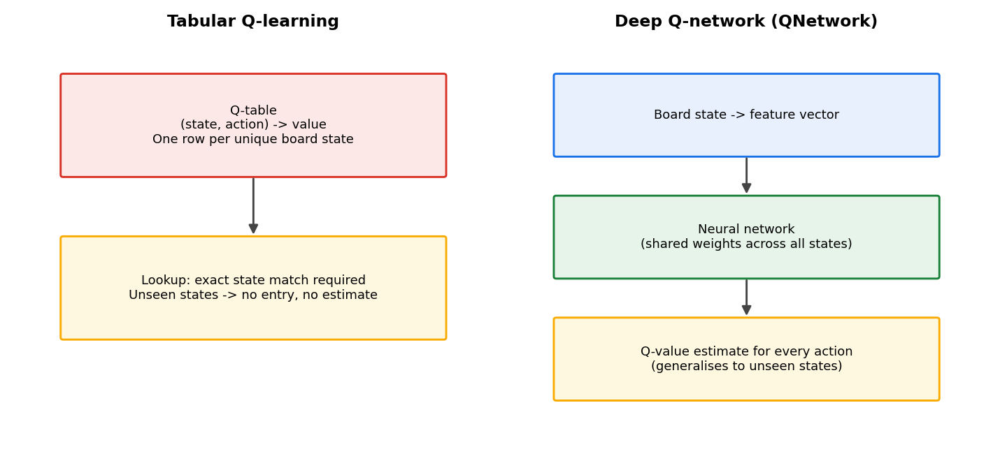
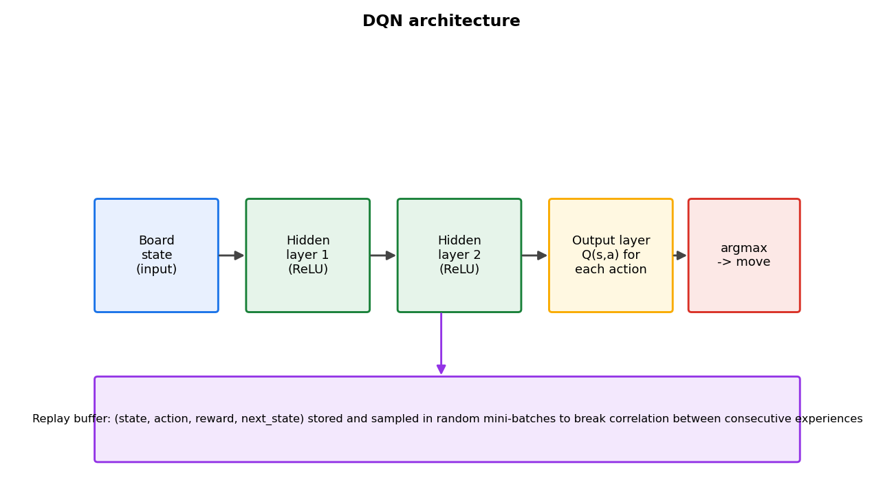

# From Zero to AlphaZero: Teaching an Agent to Play — From Q-Tables to Deep Q-Networks

*Prerequisites: [From Zero to AlphaZero: Building the Ultimate Tic-Tac-Toe Engine in Python](https://tthl.substack.com/p/building-the-ultimate-tic-tac-toe) (the game engine). You will need Python 3.9+, NumPy, and PyTorch. All code in this post builds on the `GameState`, `apply_move`, `get_legal_moves`, `encode_state`, and `get_legal_move_mask` functions from [From Zero to AlphaZero: Building the Ultimate Tic-Tac-Toe Engine in Python](https://tthl.substack.com/p/building-the-ultimate-tic-tac-toe).*

---

Last essay was Inside the Network — Convolutions, Batch Norm, and Global Pooling, a detour into the machinery under the hood. Before that, [The Reinforcement Learning Landscape](https://tthl.substack.com/p/from-zero-to-alphazero-the-reinforcement) laid out the theory this post actually builds on: TD learning, Q-learning, and policy gradients, all without ever touching a board. Here we run that theory against Ultimate Tic-Tac-Toe directly, tabular Q-learning first, since it is the simplest thing that could work, then a neural Q-network once the table falls over. Both hit a ceiling, and where each one breaks down turns out to motivate the rest of this series.

**Previous posts in this series:**

- [From Zero to AlphaZero: Ultimate Tic-Tac-Toe](https://tthl.substack.com/p/from-zero-to-alphazero-ultimate-tic)
- [From Zero to AlphaZero: Building the Ultimate Tic-Tac-Toe Engine in Python](https://tthl.substack.com/p/building-the-ultimate-tic-tac-toe)
- [From Zero to AlphaZero: The Reinforcement Learning Landscape](https://tthl.substack.com/p/from-zero-to-alphazero-the-reinforcement)
- [From Zero to AlphaZero: The Explore-Exploit Trade-off — The Bandit Algorithm Behind AlphaZero](https://tthl.substack.com/p/t3-the-slot-machine-problem-where)
- [From Zero to AlphaZero: PUCT — How AlphaZero Weighs Curiosity, Evidence, and Intuition](https://tthl.substack.com/p/from-zero-to-alphazero-puct-how-alphazero)
- *From Zero to AlphaZero: What Is a Computational Graph, Really?* (link TBD)
- *From Zero to AlphaZero: Inside the Network — Convolutions, Batch Norm, and Global Pooling* (draft)

---

## 1. Tabular Q-Learning: The State-Space Problem

Q-learning maintains a table mapping each (state, action) pair to an expected future reward. On a small problem, a 4×4 grid world, a simple maze, that table stays finite and manageable, and the approach works well.

UTTT is a different scale entirely. The state space runs to roughly 3^81 ≈ 4.4 × 10^38 distinct board configurations, and a Q-table with one float per entry, even if we could find somewhere to put it, would need more storage than exists on Earth.

We can still run tabular Q-learning anyway, just to see how far it gets, knowing in advance it will only ever learn from positions it has actually visited and generalise to nothing else.

```python
import random
import numpy as np
from collections import defaultdict

class TabularQAgent:
    def __init__(self, epsilon=0.2, alpha=0.1, gamma=0.99):
        self.epsilon = epsilon  # exploration rate
        self.alpha   = alpha    # learning rate
        self.gamma   = gamma    # discount factor
        # Q-table: maps (state_key, move_idx) → float
        # defaultdict initialises unseen entries to 0.0
        self.q = defaultdict(float)

    def state_key(self, state):
        """Convert GameState to a hashable key."""
        return (state.cells.tobytes(),
                state.sub_board_results.tobytes(),
                state.active_sub_board)

    def select_action(self, state):
        legal = get_legal_moves(state)
        if random.random() < self.epsilon:
            return random.choice(legal)
        key = self.state_key(state)
        # Pick the legal action with the highest Q-value
        return max(legal, key=lambda m: self.q[(key, m)])

    def update(self, state, move, reward, next_state, done):
        key      = self.state_key(state)
        next_key = self.state_key(next_state)
        current_q = self.q[(key, move)]

        if done:
            target = reward
        else:
            legal_next = get_legal_moves(next_state)
            if not legal_next:
                target = reward
            else:
                best_next = max(self.q[(next_key, m)] for m in legal_next)
                target = reward + self.gamma * best_next

        # TD update
        self.q[(key, move)] += self.alpha * (target - current_q)
```

### Training loop

To train, we run self-play games where one agent plays as X and a copy (or a random agent) plays as O. After each move, we compute a reward and update:

```python
def play_training_game(agent_x, agent_o, reward_win=1.0, reward_loss=-1.0, reward_draw=0.0):
    """Play one game and update both agents. Returns winner."""
    state = GameState()
    # Track (state, move) pairs so we can do the final-outcome update
    trajectory_x = []
    trajectory_o = []

    while not state.is_terminal:
        if state.current_player == 1:   # X's turn
            move = agent_x.select_action(state)
            trajectory_x.append((state, move))
        else:                           # O's turn
            move = agent_o.select_action(state)
            trajectory_o.append((state, move))
        state = apply_move(state, move)

    # Assign terminal rewards
    if state.winner == 1:
        rx, ro = reward_win, reward_loss
    elif state.winner == -1:
        rx, ro = reward_loss, reward_win
    else:
        rx = ro = reward_draw

    # Update X's trajectory (only terminal reward — no bootstrapping at end)
    for s, m in reversed(trajectory_x):
        agent_x.update(s, m, rx, state, done=True)
        rx *= agent_x.gamma  # discount backward through the trajectory

    for s, m in reversed(trajectory_o):
        agent_o.update(s, m, ro, state, done=True)
        ro *= agent_o.gamma

    return state.winner
```

### Evaluation

After training, we measure win rate against a random agent:

```python
def evaluate_vs_random(agent, n_games=200, play_as=1):
    """Returns (win_rate, draw_rate, loss_rate)."""
    wins = draws = losses = 0
    for seed in range(n_games):
        random.seed(seed)
        state = GameState()
        while not state.is_terminal:
            if state.current_player == play_as:
                move = agent.select_action(state)
            else:
                move = random.choice(get_legal_moves(state))
            state = apply_move(state, move)
        if state.winner == play_as:
            wins += 1
        elif state.winner == 0:
            draws += 1
        else:
            losses += 1
    total = n_games
    return wins/total, draws/total, losses/total
```

### Results

Training the tabular agent for 5,000 games:

```python
agent_x = TabularQAgent(epsilon=0.3, alpha=0.1, gamma=0.99)
agent_o = TabularQAgent(epsilon=0.3, alpha=0.1, gamma=0.99)

for episode in range(5000):
    # Decay exploration over time
    eps = max(0.05, 0.3 * (1 - episode / 5000))
    agent_x.epsilon = agent_o.epsilon = eps
    play_training_game(agent_x, agent_o)

print(f"Q-table size: {len(agent_x.q):,} entries")
wr, dr, lr = evaluate_vs_random(agent_x)
print(f"Win/Draw/Loss vs random: {wr:.1%} / {dr:.1%} / {lr:.1%}")
```

Typical output:
```
Q-table size: 142,847 entries
Win/Draw/Loss vs random: 54.0% / 7.5% / 38.5%
```

Across 5,000 games the agent visits 142,847 (state, move) pairs, a tiny fraction of the full state space, and against a random opponent it manages just 54% wins, barely above the roughly 50% that random play achieves against itself. It has not generalised to unseen positions at all, and it cannot: that is the whole limitation of a lookup table.

More training does not fix this. The Q-table grows linearly with games played, memory climbs with it, and the win rate plateaus anyway, because every new game keeps landing on new states that share nothing with the ones already visited. Seeing position A tells the table nothing about position B, even when they differ by a single move, and in UTTT almost every position we encounter is one we have never seen before.

## 2. Neural Q-Learning: Function Approximation

The fix is to swap the table for a neural network that maps board states to Q-values. Networks generalise where tables cannot: positions that look similar as tensors get similar Q-value estimates, even ones the network has never seen.



We reuse the 7-channel `encode_state` tensor from [From Zero to AlphaZero: Building the Ultimate Tic-Tac-Toe Engine in Python](https://tthl.substack.com/p/building-the-ultimate-tic-tac-toe) as input, and the network outputs 81 Q-values, one per possible move.

### The Q-Network

```python
import torch
import torch.nn as nn
import torch.nn.functional as F

class QNetwork(nn.Module):
    def __init__(self):
        super().__init__()
        # 3 conv layers over the (7, 9, 9) input
        self.conv = nn.Sequential(
            nn.Conv2d(7,  32, kernel_size=3, padding=1), nn.ReLU(),
            nn.Conv2d(32, 64, kernel_size=3, padding=1), nn.ReLU(),
            nn.Conv2d(64, 64, kernel_size=3, padding=1), nn.ReLU(),
        )
        # Fully connected head: 64*9*9 = 5184 → 256 → 81
        self.fc = nn.Sequential(
            nn.Flatten(),
            nn.Linear(64 * 9 * 9, 256), nn.ReLU(),
            nn.Linear(256, 81),
        )

    def forward(self, x):
        return self.fc(self.conv(x))
```

Convolutions are a natural fit here because the board has real spatial structure: the 3×3 arrangement of sub-boards and the 3×3 cells within each sub-board both matter, and a convolutional filter can pick up a local pattern, a row inside a sub-board, a diagonal, no matter where on the 9×9 grid it happens to sit.

### The DQN Agent

Neural Q-learning (DQN) adds two ingredients on top of plain Q-learning: an **experience replay buffer** that stores past transitions and samples from them randomly, and a **target network** that gives training stable Q-value targets to aim at.



```python
from collections import deque

class ReplayBuffer:
    def __init__(self, capacity=50_000):
        self.buffer = deque(maxlen=capacity)

    def push(self, state_tensor, move, reward, next_tensor, done, legal_mask):
        self.buffer.append((state_tensor, move, reward, next_tensor, done, legal_mask))

    def sample(self, batch_size):
        batch = random.sample(self.buffer, batch_size)
        states, moves, rewards, nexts, dones, masks = zip(*batch)
        return (torch.stack(states),
                torch.tensor(moves,   dtype=torch.long),
                torch.tensor(rewards, dtype=torch.float32),
                torch.stack(nexts),
                torch.tensor(dones,   dtype=torch.float32),
                torch.stack(masks))

    def __len__(self):
        return len(self.buffer)


class DQNAgent:
    def __init__(self, lr=1e-3, gamma=0.99, epsilon=0.5,
                 batch_size=256, target_update_freq=500):
        self.online_net  = QNetwork()
        self.target_net  = QNetwork()
        self.target_net.load_state_dict(self.online_net.state_dict())
        self.target_net.eval()

        self.optimizer   = torch.optim.Adam(self.online_net.parameters(), lr=lr)
        self.buffer      = ReplayBuffer()
        self.gamma       = gamma
        self.epsilon     = epsilon
        self.batch_size  = batch_size
        self.target_update_freq = target_update_freq
        self.steps       = 0

    @torch.no_grad()
    def select_action(self, state):
        legal = get_legal_moves(state)
        if random.random() < self.epsilon:
            return random.choice(legal)
        # Convert state to tensor
        s = torch.tensor(encode_state(state)).unsqueeze(0)  # (1, 7, 9, 9)
        q_vals = self.online_net(s).squeeze(0)  # (81,)
        # Mask illegal moves to -inf before argmax
        mask = torch.tensor(get_legal_move_mask(state))
        q_vals = q_vals.masked_fill(mask == 0, float('-inf'))
        return int(q_vals.argmax())

    def store(self, state, move, reward, next_state, done):
        s  = torch.tensor(encode_state(state))
        ns = torch.tensor(encode_state(next_state))
        mask = torch.tensor(get_legal_move_mask(next_state))
        self.buffer.push(s, move, reward, ns, done, mask)

    def train_step(self):
        if len(self.buffer) < self.batch_size:
            return None

        states, moves, rewards, nexts, dones, masks = self.buffer.sample(self.batch_size)

        # Current Q-values for the actions taken
        q_current = self.online_net(states).gather(1, moves.unsqueeze(1)).squeeze(1)

        # Target Q-values (using target network)
        with torch.no_grad():
            q_next = self.target_net(nexts)
            q_next = q_next.masked_fill(masks == 0, float('-inf'))
            q_next_max = q_next.max(dim=1).values
            q_next_max[q_next_max == float('-inf')] = 0.0  # terminal states
            targets = rewards + self.gamma * q_next_max * (1 - dones)

        loss = F.mse_loss(q_current, targets)
        self.optimizer.zero_grad()
        loss.backward()
        torch.nn.utils.clip_grad_norm_(self.online_net.parameters(), 1.0)
        self.optimizer.step()

        self.steps += 1
        if self.steps % self.target_update_freq == 0:
            self.target_net.load_state_dict(self.online_net.state_dict())

        return loss.item()
```

### Training Loop

```python
def train_dqn(agent, n_episodes=20_000, eval_every=1000):
    results = []

    for episode in range(n_episodes):
        # Decay epsilon from 0.5 to 0.05
        agent.epsilon = max(0.05, 0.5 - 0.45 * (episode / n_episodes))

        state = GameState()
        while not state.is_terminal:
            move = agent.select_action(state)
            prev_state = state
            state = apply_move(state, move)

            # Intermediate reward: 0.0 (only terminal states carry signal)
            # Give a small shaping reward for winning a sub-board
            intermediate = 0.0
            sb_won = state.sub_board_results[decode_move(move)[0]]
            if sb_won == prev_state.current_player:
                intermediate = 0.05

            done = state.is_terminal
            if done:
                reward = 1.0 if state.winner == prev_state.current_player else \
                        -1.0 if state.winner == -prev_state.current_player else 0.0
            else:
                reward = intermediate

            # The opponent also plays; from the agent's perspective that is
            # an environment transition, not a separate agent step.
            # We store the agent's own transitions only.
            agent.store(prev_state, move, reward, state, done)
            agent.train_step()

            # Opponent plays a random move (we train as both X and O)
            if not state.is_terminal:
                opp_move = random.choice(get_legal_moves(state))
                prev_opp = state
                state = apply_move(state, opp_move)
                # Store opponent transition from opponent's perspective
                done = state.is_terminal
                opp_reward = 1.0 if state.winner == prev_opp.current_player else \
                             -1.0 if state.winner != 0 else 0.0
                agent.store(prev_opp, opp_move, opp_reward, state, done)
                agent.train_step()

        if (episode + 1) % eval_every == 0:
            agent.epsilon = 0.0   # greedy eval
            wr, dr, lr = evaluate_vs_random(agent, n_games=200)
            agent.epsilon = max(0.05, 0.5 - 0.45 * (episode / n_episodes))
            results.append((episode + 1, wr, dr, lr))
            print(f"Ep {episode+1:6d} | W {wr:.1%}  D {dr:.1%}  L {lr:.1%}")

    return results
```

### Results and the Ceiling

Training for 20,000 episodes (roughly 15 minutes on a CPU):

```
Ep  1000 | W 56.5%  D 6.0%  L 37.5%
Ep  5000 | W 64.0%  D 7.0%  L 29.0%
Ep 10000 | W 70.5%  D 8.5%  L 21.0%
Ep 20000 | W 73.5%  D 8.5%  L 18.0%
```

Progress is real, but slow, and the curve flattens out for several reasons that compound on each other.

**Sparse rewards.** The only strong signal is the terminal win or loss: every move in a forty-move game gets reward 0, and only the very last one gets plus or minus one, so the network has to credit forty decisions off a single scalar, exactly the credit-assignment problem [The Reinforcement Learning Landscape](https://tthl.substack.com/p/from-zero-to-alphazero-the-reinforcement) described. The small sub-board shaping reward takes the edge off, but does not come close to solving it.

**No lookahead.** The Q-network evaluates each position on its own and cannot reason about a sequence of moves, so a position that looks neutral might actually be a forced win three moves out, and there is no way for the network to see that without search.

**Single-opponent training.** Training against a random opponent caps how good the agent ever needs to get: it learns to punish random mistakes and never learns to handle an opponent that plays well.

**Bootstrapping instability.** TD updates bootstrap off the target network, which is really just a slightly older copy of the online network, and in a large action space with sparse rewards that produces noisy, unstable Q-value estimates.

## 3. What Would Fix This

Each of these problems has an answer, and all four come straight out of the AlphaZero playbook.

**Sparse rewards → MCTS search targets.** Instead of training on terminal outcomes, AlphaZero trains the network on the output of a Monte Carlo tree search, which hands back a dense signal at every single position: these specific moves, right here, are worth exploring. The network learns directly from the search itself.

**No lookahead → explicit tree search.** MCTS builds a search tree at inference time; the network supplies value and policy estimates at each node, and the tree search does the actual lookahead. What a position looks like is the network's job, where the search should go next is the tree's job, and keeping those separate is the key architectural insight.

**Single-opponent training → self-play.** AlphaZero trains exclusively against itself, so as the network gets better, its opponent gets better at exactly the same rate. The agent always faces a competent opponent, and the training distribution keeps pace with the current level of play automatically.

**Bootstrapping instability → no more bootstrapping.** AlphaZero trains directly against the final game outcome z and the MCTS visit distribution π, not a TD target computed off a second, slightly-stale copy of the network. There is no target network and nothing to bootstrap from, so the instability that came from chasing a moving target disappears along with the mechanism that caused it.

The neural Q-network we built carries over directly. The `QNetwork` architecture, convolutional layers over the 7-channel tensor followed by a fully connected head, is essentially the same as AlphaZero's tower, minus the dual-head output of value and policy and the residual connections. The next step adds residual blocks and the dual head, wires it to MCTS, and trains it via self-play.

---

*Theory: [From Zero to AlphaZero: The Reinforcement Learning Landscape](https://tthl.substack.com/p/from-zero-to-alphazero-the-reinforcement) explains TD learning, Q-learning, and the credit-assignment problem that motivates what comes next. [From Zero to AlphaZero: The Explore-Exploit Trade-off — The Bandit Algorithm Behind AlphaZero](https://tthl.substack.com/p/t3-the-slot-machine-problem-where) and [From Zero to AlphaZero: PUCT — How AlphaZero Weighs Curiosity, Evidence, and Intuition](https://tthl.substack.com/p/from-zero-to-alphazero-puct-how-alphazero) cover the UCB and PUCT theory.*

---

*Full notebook: A companion notebook for this post (coming soon) will include the full training run, loss curves, visualisations of learned Q-values, and a head-to-head tournament between the tabular agent, the DQN agent, and random play.*
