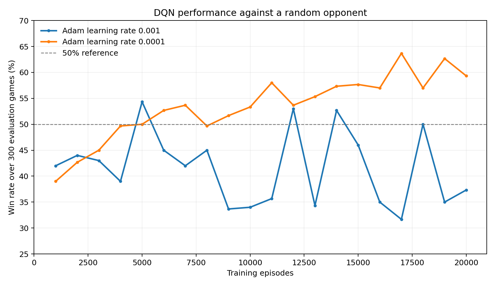

# From Zero to AlphaZero: Teaching an Agent to Play, Part 2 — Deep Q-Learning

In Part 1, we built a Q-table for Ultimate Tic-Tac-Toe and watched it hit a wall: the table only knows what it has seen, and in a game this large almost every position is new. Seeing position A tells it nothing about position B, even when they differ by a single move, so a table that has to see every state before it can say anything useful about it was never going to scale. What we actually want is something that can compare a new position to similar ones it has already learned from, and generalise. That's exactly what a neural network gives us.

**Previous posts in this series:**

- [From Zero to AlphaZero: Ultimate Tic-Tac-Toe](https://tthl.substack.com/p/from-zero-to-alphazero-ultimate-tic)
- [From Zero to AlphaZero: Building the Ultimate Tic-Tac-Toe Engine in Python](https://tthl.substack.com/p/building-the-ultimate-tic-tac-toe)
- [From Zero to AlphaZero: The Reinforcement Learning Landscape](https://tthl.substack.com/p/from-zero-to-alphazero-the-reinforcement)
- [From Zero to AlphaZero: The Explore-Exploit Trade-off — The Bandit Algorithm Behind AlphaZero](https://tthl.substack.com/p/t3-the-slot-machine-problem-where)
- [From Zero to AlphaZero: PUCT — How AlphaZero Weighs Curiosity, Evidence, and Intuition](https://tthl.substack.com/p/from-zero-to-alphazero-puct-how-alphazero)
- [From Zero to AlphaZero: What Is a Computational Graph, Really?](https://tthl.substack.com/p/from-zero-to-alphazero-what-is-a)
- [From Zero to AlphaZero: Teaching an Agent to Play, Part 1 — Tabular Q-Learning](https://tthl.substack.com/p/from-zero-to-alphazero-teaching-an)

---

## Neural Q-Learning: Function Approximation

The fix is to swap the table for a neural network that maps board states to Q-values. Networks generalise where tables cannot: positions that look similar as tensors get similar Q-value estimates, even ones the network has never seen.


We reuse the 7-channel `encode_state` tensor from [From Zero to AlphaZero: Building the Ultimate Tic-Tac-Toe Engine in Python](https://tthl.substack.com/p/building-the-ultimate-tic-tac-toe) as input, and the network outputs 81 Q-values, one per possible move.

### The Q-Network

The network is three convolutional layers over the (7, 9, 9) board tensor, flattened into a two-layer fully connected head producing 81 Q-values: [dqn/model.py, lines 12–58](https://github.com/thltsui/RecursiveTicTacToe/blob/8e19888892029b086e01376cfbe0d4f7aaace3e4/experiments/dqn/model.py#L12-L58).

Convolutions are a natural fit here because the board has real spatial structure: the 3×3 arrangement of sub-boards and the 3×3 cells within each sub-board both matter, and a convolutional filter can pick up a local pattern, a row inside a sub-board, a diagonal, no matter where on the 9×9 grid it happens to sit.

### The DQN Agent

Neural Q-learning (DQN) adds two ingredients on top of plain Q-learning: an **experience replay buffer** that stores past transitions and samples from them randomly, and a **target network** that gives training stable Q-value targets to aim at.

Training the network means giving it something to predict, the same idea as the table above, with a differentiable function standing in for the lookup. Because the encoder always represents the current player, each stored transition spans from one DQN decision to its next decision after the random opponent replies. Both s and s′ therefore belong to the learning agent's perspective, and the target is r + γ · max Q_target(s′, a′) for non-terminal transitions, or just r when the game has ended. The loss is the mean squared error between that target and Q(s, a); calling .backward() propagates the correction through the fully connected head and convolutional layers.


The replay buffer holds 100,000 transitions. After a 1,000-transition warm-up, training samples a batch of 32 every four DQN decisions. Action selection is epsilon-greedy over the online network's Q-values, masked to legal moves; every 500 gradient steps, the online weights are copied to the target network.

### Training Loop

Training alternates the DQN between X and O against a uniform-random opponent. We store only the DQN's decisions. Each replay transition runs from one DQN turn to its next turn, after the random reply, so both states are encoded from the learning agent's perspective. After the warm-up, the agent performs one gradient update every four DQN decisions. The outer loop runs for 20,000 episodes, with epsilon decaying from 0.5 to 0.05 and evaluation every 1,000 episodes.

### Results and the Ceiling

I ran two 20,000-episode CPU experiments with seed 0. Each checkpoint was evaluated over the same 300 games, alternating X and O. The inherited Adam learning rate of 0.001 was unstable; lowering it to 0.0001 produced sustained improvement. The stable run took 2,286 seconds—38 minutes 6 seconds—on this machine.

```
Ep  1000 | W 39.0%  D 24.7%  L 36.3%
Ep  5000 | W 50.0%  D 21.0%  L 29.0%
Ep 10000 | W 53.3%  D 15.3%  L 31.3%
Ep 15000 | W 57.7%  D 18.0%  L 24.3%
Ep 20000 | W 59.3%  D 15.3%  L 25.3%

Final checkpoint, fresh 2,000-game evaluation:
W 60.1%  D 13.1%  L 26.8%
```



The lower-rate agent improved from 39.0% wins at 1,000 episodes to 59.3% at 20,000, peaking at 63.7% at episode 17,000. A separate 2,000-game evaluation of the final checkpoint measured 60.1% wins, 13.1% draws, and 26.8% losses. That is a genuine edge over random, but also a clear ceiling: more training did not produce anything close to expert play.

**Sparse rewards.** A typical game contains roughly twenty DQN decisions. Most transitions receive zero reward, with only a small ±0.05 sub-board shaping signal; the terminal ±1 outcome appears once. The network must propagate that late information backward through a long chain of estimates, exactly the credit-assignment problem [The Reinforcement Learning Landscape](https://tthl.substack.com/p/from-zero-to-alphazero-the-reinforcement) described.

**No lookahead.** The Q-network evaluates each position on its own and cannot reason about a sequence of moves, so a position that looks neutral might actually be a forced win three moves out, and there is no way for the network to see that without search.

**Single-opponent training.** Training against a random opponent caps how good the agent ever needs to get: it learns to punish random mistakes and never learns to handle an opponent that plays well.

**Bootstrapping instability.** Each update nudges one estimate toward another estimate. We saw this directly: with Adam at 0.001, the win rate swung between 31.7% and 54.3% and finished at 35.1% over 2,000 fresh games. Lowering the rate to 0.0001 made learning slower but far more stable.

## What Would Fix This

Each of these problems has an answer, and all four come straight out of the AlphaZero playbook.

**Sparse rewards → MCTS search targets.** Instead of training on terminal outcomes, AlphaZero trains the network on the output of a Monte Carlo tree search, which hands back a dense signal at every single position: these specific moves, right here, are worth exploring. The network learns directly from the search itself.

**No lookahead → explicit tree search.** MCTS builds a search tree at inference time; the network supplies value and policy estimates at each node, and the tree search does the actual lookahead. What a position looks like is the network's job, where the search should go next is the tree's job, and keeping those separate is the key architectural insight.

**Single-opponent training → self-play.** AlphaZero trains exclusively against itself, so as the network gets better, its opponent gets better at exactly the same rate. The agent always faces a competent opponent, and the training distribution keeps pace with the current level of play automatically.

**Bootstrapping instability → no more bootstrapping.** AlphaZero trains directly against the final game outcome z and the MCTS visit distribution π, not a TD target computed off a second, slightly-stale copy of the network. There is no target network and nothing to bootstrap from, so the instability that came from chasing a moving target disappears along with the mechanism that caused it.

The neural Q-network we built carries over directly. The `QNetwork` architecture, convolutional layers over the 7-channel tensor followed by a fully connected head, is essentially the same as AlphaZero's tower, minus the dual-head output of value and policy and the residual connections. The next step adds residual blocks and the dual head, wires it to MCTS, and trains it via self-play.

---

*Theory: [From Zero to AlphaZero: The Reinforcement Learning Landscape](https://tthl.substack.com/p/from-zero-to-alphazero-the-reinforcement) explains TD learning, Q-learning, and the credit-assignment problem that motivates what comes next. [From Zero to AlphaZero: The Explore-Exploit Trade-off — The Bandit Algorithm Behind AlphaZero](https://tthl.substack.com/p/t3-the-slot-machine-problem-where) and [From Zero to AlphaZero: PUCT — How AlphaZero Weighs Curiosity, Evidence, and Intuition](https://tthl.substack.com/p/from-zero-to-alphazero-puct-how-alphazero) cover the UCB and PUCT theory.*

---

*Reproducibility: the experiment runner records its configuration, checkpoint evaluations, elapsed time, and final checkpoint. The reported final result was re-evaluated over 2,000 games after training; it is not the best point selected from the learning curve.*
