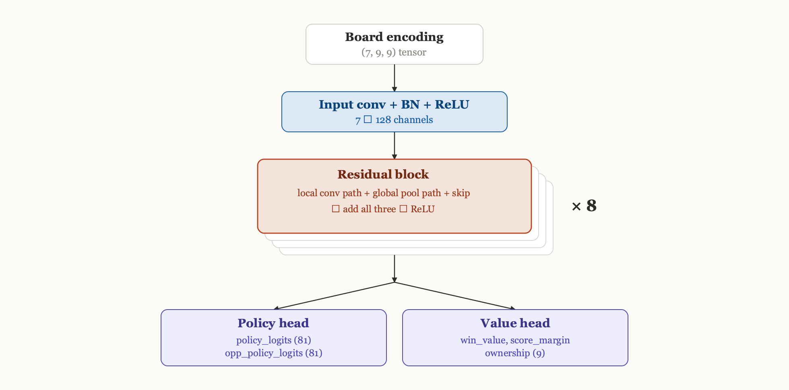
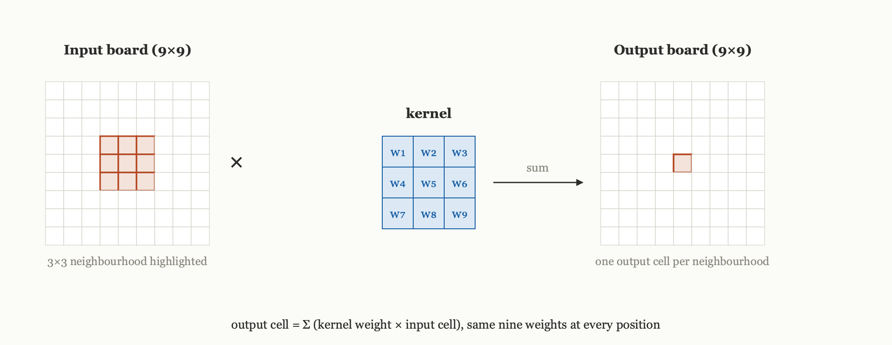
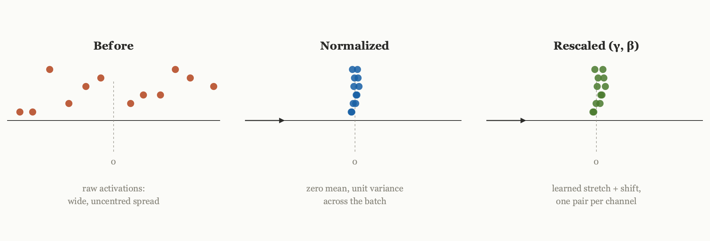
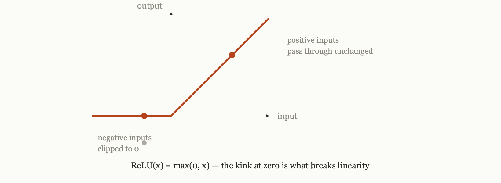

# From Zero to AlphaZero: Inside the Network — Convolutions, Batch Norm, and Global Pooling

Last essay, Teaching an Agent to Play Part 2, built a plain Q-network, convolutions over the board tensor feeding a fully connected head guessing 81 Q-values, and watched it plateau at 73.5% against random play. The fix carries the same convolutional idea forward but adds two things: residual blocks, so depth does not undermine itself, and a dual head that scores moves and judges the position separately. This post looks at the actual network this project's agent uses: what its layers are, what each one does on its own, and why stacking them this particular way is what makes the whole thing work.

**Previous posts in this series:**

- [From Zero to AlphaZero: Ultimate Tic-Tac-Toe](https://tthl.substack.com/p/from-zero-to-alphazero-ultimate-tic)
- [From Zero to AlphaZero: Building the Ultimate Tic-Tac-Toe Engine in Python](https://tthl.substack.com/p/building-the-ultimate-tic-tac-toe)
- [From Zero to AlphaZero: The Reinforcement Learning Landscape](https://tthl.substack.com/p/from-zero-to-alphazero-the-reinforcement)
- [From Zero to AlphaZero: The Explore-Exploit Trade-off — The Bandit Algorithm Behind AlphaZero](https://tthl.substack.com/p/t3-the-slot-machine-problem-where)
- [From Zero to AlphaZero: PUCT — How AlphaZero Weighs Curiosity, Evidence, and Intuition](https://tthl.substack.com/p/from-zero-to-alphazero-puct-how-alphazero)
- [From Zero to AlphaZero: What Is a Computational Graph, Really?](https://tthl.substack.com/p/from-zero-to-alphazero-what-is-a)
- *From Zero to AlphaZero: Teaching an Agent to Play, Part 1 — Tabular Q-Learning* (draft)
- *From Zero to AlphaZero: Teaching an Agent to Play, Part 2 — Deep Q-Learning* (link TBD)

---

## What the network sees

Before any of this runs, a board position has to become numbers. `encode_state` (in [`01_game/board.py`](https://github.com/thltsui/RecursiveTicTacToe/blob/main/01_game/board.py#L61-L142)) turns a game state into a (7, 9, 9) tensor, seven 9-by-9 grids stacked on top of each other: the current player's pieces, the opponent's pieces, which cells are legal to play in right now, which sub-boards the current player has already won, which the opponent has won, which are drawn, and a single flag for whose turn it is. Every one of those seven grids lines up with the actual board, cell for cell, so the network's very first view of the game is already shaped like the game itself.

## The shape of the network



[`UltimateTTTNetwork`](https://github.com/thltsui/RecursiveTicTacToe/blob/main/02_network/network.py#L67-L111) takes that (7, 9, 9) input, runs it through one convolution to lift it to 128 channels, passes the result through eight identical residual blocks that keep reshaping those 128 channels without changing the 9×9 spatial size, and finally splits into two heads: a policy head that scores the 81 possible moves, and a value head that judges how good the position is for the player to move. Almost everything worth understanding happens inside those eight residual blocks, so that is where the rest of this post lives. Each block is three simple operations, convolution, batch normalization, and ReLU, repeated twice, plus one extra branch we will get to at the end.

## Convolution: the same small pattern detector, swept over every cell

A 3×3 convolution looks at one cell together with the eight cells around it, multiplies each of those nine cells by a learned weight, adds the results, and writes that sum to the output at that cell's position. Sliding that same set of nine weights over all 81 cells turns one convolution into 81 of these local calculations, one per cell, all sharing exactly the same weights.

That sharing is the whole point for a board game. Whatever pattern the weights learn to respond to, two pieces in a line, an open corner, gets detected the same way wherever it shows up on the board, rather than the network having to learn a separate detector for every one of the 81 positions.

Each residual block runs two of these in sequence:

[`ResidualBlock.__init__`](https://github.com/thltsui/RecursiveTicTacToe/blob/main/02_network/residual_block.py#L42-L60) declares them, [`forward`](https://github.com/thltsui/RecursiveTicTacToe/blob/main/02_network/residual_block.py#L62-L87) is where they run:

```python
self.conv1 = nn.Conv2d(channels, channels, kernel_size=3, padding=1, bias=False)
self.conv2 = nn.Conv2d(channels, channels, kernel_size=3, padding=1, bias=False)
...
local = self.conv1(x)
...
local = self.conv2(local)
```



## Batch normalization: keeping the numbers in a sane range

Eight residual blocks stacked means a value computed at the very first block gets multiplied and added many times over before the network is done with it, and repeated multiplication tends to push numbers toward extremes, some enormous, some vanishingly small, within just a few layers. Batch normalization is the fix: after each convolution, it takes the batch of values currently at that point, rescales them to zero mean and unit variance, then applies a small learned rescaling of its own, one multiplier and one offset per channel, called gamma and beta, so the network can still stretch or shift the result if that turns out to help.

It is a bookkeeping step rather than a pattern detector, but a stack this deep tends to train unreliably or fail outright without it.

```python
self.bn1 = nn.BatchNorm2d(channels)
self.bn2 = nn.BatchNorm2d(channels)
...
local = self.bn1(local)
...
local = self.bn2(local)
```



## ReLU: throwing away the negative half

After the first convolution and batch norm comes a ReLU, the simplest operation of the three: it replaces any negative number with zero and leaves positive numbers untouched.

On its own that sounds too simple to matter, but it is what keeps the stack from collapsing into something no more powerful than a single layer. A convolution is a linear operation, and stacking several linear operations back to back is mathematically equivalent to one bigger linear operation, since a linear function of a linear function is still linear. ReLU breaks that: because it treats positive and negative values differently, a convolution followed by a ReLU is no longer linear, and stacking these nonlinear steps lets later blocks combine earlier features in ways a single convolution never could.

```python
self.relu = nn.ReLU(inplace=True)
...
local = self.relu(local)
```



## Putting the two convolutions together: a residual block, minus one branch

Follow the local branch straight through and it is conv, batch norm, ReLU, conv, batch norm, exactly the three operations above, run twice:

```python
local = self.conv1(x)
local = self.bn1(local)
local = self.relu(local)
local = self.conv2(local)
local = self.bn2(local)
```

Notice there is no ReLU after the second batch norm. That is deliberate: the block adds this local branch back onto its own input before applying a final ReLU, and that addition, `x + local`, is the skip connection that makes residual networks work. Without it, a plain stack of eight convolutional blocks tends to get worse as it gets deeper: gradients calculated at the output have to pass back through all eight blocks to reach the first one, and layer after layer of that tends to shrink them toward zero by the time they arrive, leaving the earliest blocks barely trained at all. The skip connection gives the gradient a direct path back to the input that does not pass through any of the convolutions, so even if the local branch is contributing very little at some point in training, the block as a whole still behaves close to the identity rather than actively destroying information.

## The other branch: seeing the whole board at once

A 3×3 convolution only ever looks at a cell and its immediate neighbours. Stack a few of these and the effective receptive field grows, but it grows slowly: after two layers a cell can only be influenced by roughly a 5×5 patch around it, nowhere near the full 9×9 board.

That is a problem specific to Ultimate Tic-Tac-Toe's sending mechanic: the move just played decides which sub-board the opponent must play in next, and that sub-board can be anywhere on the 9×9 grid, arbitrarily far from the cell that was just played. A purely local convolutional stack has no efficient way to let a move in one corner of the board immediately inform what is relevant on the opposite corner.

The fix, borrowed from KataGo, is a second branch inside every residual block that looks at the whole board at once:

```python
pooled = x.mean(dim=[2, 3])                              # (B, C)
global_vec = self.global_mlp(pooled)                     # (B, C)
global_broadcast = global_vec.unsqueeze(-1).unsqueeze(-1).expand_as(x)  # (B, C, 9, 9)
```

`x.mean(dim=[2, 3])` collapses the entire 9×9 board down to a single vector per channel, one number summarising that channel's activity everywhere on the board. That vector passes through a small two-layer network (`global_mlp`, channels down to channels // 8 and back up), then gets copied back out to every one of the 81 positions. After that broadcast, every cell carries a little information about what is happening on the entire board, not just its own neighbourhood.

The block's final line adds all three signals together, the local branch, the global branch, and the skip connection, before one last ReLU:

```python
out = self.relu(local + global_broadcast + identity)
```

## The two heads

After the input convolution and eight residual blocks, the shared (B, 128, 9, 9) trunk output splits into two separate modules with entirely separate weights. [`PolicyHead`](https://github.com/thltsui/RecursiveTicTacToe/blob/main/02_network/policy_head.py#L40-L76) reduces the trunk down to 81 raw scores, one per legal move; it also produces a second, auxiliary set of 81 scores predicting the opponent's likely reply, used only during training to encourage the trunk to model both sides of the board. [`ValueHead`](https://github.com/thltsui/RecursiveTicTacToe/blob/main/02_network/value_head.py#L59-L95) produces a single tanh-bounded win probability for the position, plus two more auxiliary training targets, a predicted score margin and a per-sub-board ownership estimate, giving every position richer signal to train on than a single win-or-lose number would.

The whole network, input convolution plus eight residual blocks plus both heads, comes to roughly 3.5 million parameters. AlphaZero's chess network uses 20 blocks of 256 channels; eight blocks of 128 is sized for a much smaller game.

Training this network, and what those auxiliary outputs are actually for, is the subject of a later post.
