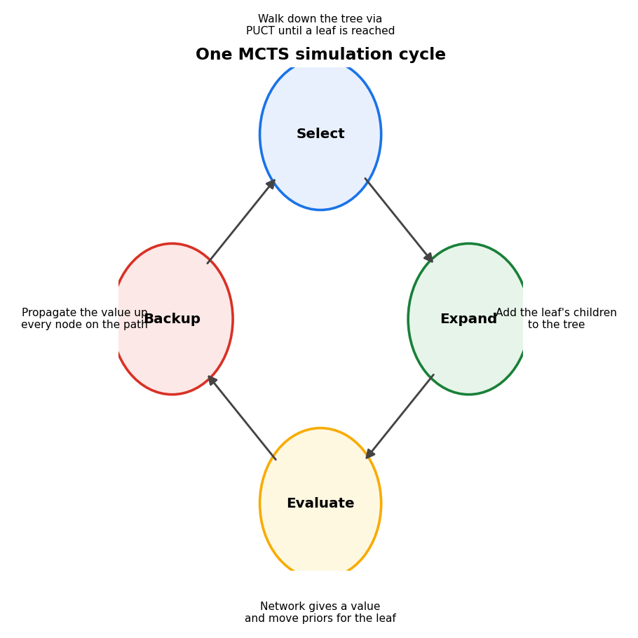
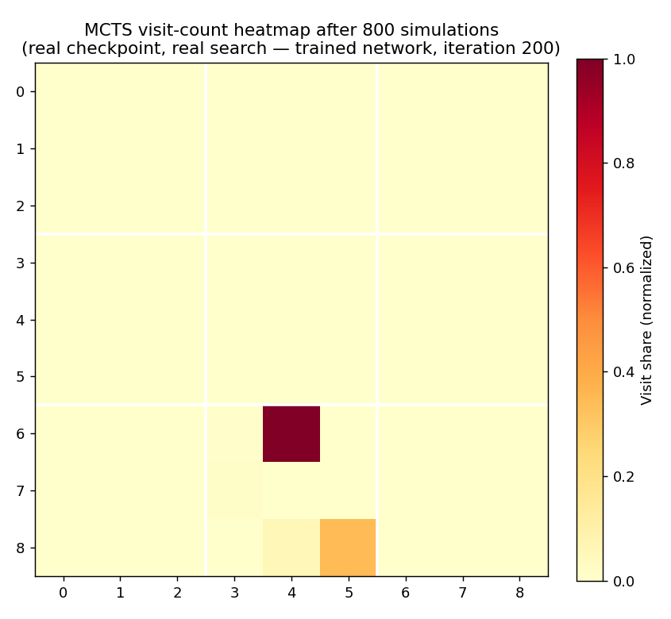

# From Zero to AlphaZero: Inside One MCTS Simulation — How AlphaZero Thinks Move by Move

Last essay, Inside the Network — Convolutions, Batch Norm, and Global Pooling, built the actual network this project's agent uses: residual blocks, global pooling, and a dual head producing a policy and a value estimate. On its own that network still cannot look ahead, one of the ceilings Teaching an Agent to Play ran into. The fix is [PUCT — How AlphaZero Weighs Curiosity, Evidence, and Intuition](https://tthl.substack.com/p/from-zero-to-alphazero-puct-how-alphazero), the formula that governs how AlphaZero explores a game tree. This essay shows the full loop: how MCTS actually builds a search tree, one simulation at a time, guided by PUCT, and why the result is a move selection strategy that is strictly better than the network's raw output.

**Previous posts in this series:**

- [From Zero to AlphaZero: Ultimate Tic-Tac-Toe](https://tthl.substack.com/p/from-zero-to-alphazero-ultimate-tic)
- [From Zero to AlphaZero: Building the Ultimate Tic-Tac-Toe Engine in Python](https://tthl.substack.com/p/building-the-ultimate-tic-tac-toe)
- [From Zero to AlphaZero: The Reinforcement Learning Landscape](https://tthl.substack.com/p/from-zero-to-alphazero-the-reinforcement)
- [From Zero to AlphaZero: The Explore-Exploit Trade-off — The Bandit Algorithm Behind AlphaZero](https://tthl.substack.com/p/t3-the-slot-machine-problem-where)
- [From Zero to AlphaZero: PUCT — How AlphaZero Weighs Curiosity, Evidence, and Intuition](https://tthl.substack.com/p/from-zero-to-alphazero-puct-how-alphazero)
- *From Zero to AlphaZero: What Is a Computational Graph, Really?* (link TBD)
- *From Zero to AlphaZero: Teaching an Agent to Play, Part 1 — Tabular Q-Learning* (draft)
- *From Zero to AlphaZero: Teaching an Agent to Play, Part 2 — Deep Q-Learning* (link TBD)
- *From Zero to AlphaZero: Inside the Network — Convolutions, Batch Norm, and Global Pooling* (draft)

---

## The Problem

Fifteen moves into a game of Ultimate Tic-Tac-Toe, with seven legal moves available, we could in principle enumerate every possible continuation. With a branching factor of roughly nine and games lasting thirty to sixty moves, however, searching to depth ten means evaluating 9^10 ≈ 3.5 billion positions, which is not achievable within any real-time budget.

Even if it were, we would still need something to score the leaf positions, and building a reliable heuristic evaluator for Ultimate TTT is genuinely hard: it cannot be hand-crafted from scratch.

The natural response is what a thoughtful human does: spend the available thinking time on the promising moves rather than distributing it evenly, and make a judgment call about a position rather than simulating every game to its end. MCTS formalises this idea.

## Four Phases, One Simulation

MCTS builds a partial game tree incrementally, one simulation at a time. Each simulation follows four phases: Select, Expand, Evaluate, and Backup.

### Select

Starting from the root, the current game position, we traverse the existing tree by picking the most promising child at each node, defined by the PUCT formula, and keep descending until we reach a leaf, a node that has not yet been expanded.

We are moving through the already-built portion of the tree, following the best path found by previous simulations. The tree grows simulation by simulation, and each pass through Select follows a path carved by everything that came before it.

### Expand

At the leaf, we call the neural network. It returns two things simultaneously:

- **Policy** — a probability distribution over all legal moves from this position, reflecting the network's prior beliefs about which moves are worth exploring.
- **Value** — a number in [−1, +1] estimating how favourable this position is for the current player.

We add the leaf node to the tree, storing the network's prior probabilities as the starting weights for its children.

Classic MCTS simulates a random game from the leaf to the end and uses the outcome as the value estimate. AlphaZero replaces this random rollout with a direct network evaluation, which is faster and far more accurate once the network is trained, so the neural network itself serves as the oracle.

### Evaluate

The value returned by the network during Expand is already the leaf evaluation, so no additional step is needed. The network simultaneously handles expansion, via policy, and evaluation, via value, in a single forward pass.

### Backup

The leaf's value propagates back up through all ancestor nodes to the root. At each edge on the path, three statistics update:

- **N(s, a)** — the visit count: how many simulations have passed through this edge.
- **W(s, a)** — the total accumulated value: the sum of leaf values from all simulations through this edge.
- **Q(s, a) = W / N** — the mean value: the average quality of this action across all simulations that explored it.

The value gets negated at each level as it propagates upward, and that detail matters more than it looks. If the leaf indicates a position is winning, at +0.8, that is good news for the player who chose to move there, but bad news for their opponent one level higher. This sign flip at every backup step automatically handles the two-player zero-sum structure, so AlphaZero never needs separate tables for each player.

After backup, every node on the path from root to leaf has richer statistics. The next simulation uses these updated counts and values when deciding where to go.

## PUCT: The Steering Wheel

The formula governing selection at every node:

$$\text{PUCT}(s, a) = Q(s, a) + c_{\text{puct}} \cdot P(s, a) \cdot \frac{\sqrt{N(s)}}{1 + N(s, a)}$$

Q(s, a) is exploitation: the empirical mean value of action a. High Q means this branch has consistently produced good simulations.

The exploration term has three factors:

- **P(s, a)**: the network's prior. Moves the network likes get a boost even before being visited. This is what focuses search: without it, MCTS would explore all legal moves equally regardless of how obviously bad some are.
- **√N(s)**: grows with total visits to the parent. The more we have explored from this node, the larger the exploration bonus for its children.
- **1 / (1 + N(s, a))**: shrinks as action a accumulates visits. An unvisited move gets full bonus; after many visits, the bonus collapses and Q dominates.

Combined effect: early in search, the prior drives exploration and we visit moves roughly in order of the network's confidence. As simulations accumulate, Q values sharpen and the search converges on the moves that are genuinely best.

## Why MCTS Needs the Neural Network (and Vice Versa)

Try running MCTS with a randomly initialised network, weights set to small random values before any training has happened. The policy head outputs nearly uniform probabilities across all legal moves, and the value head returns something close to zero everywhere.

With a uniform prior, PUCT degenerates to visiting whichever move has been explored least. After eight hundred simulations over nine legal moves, this produces roughly 89 visits per move, almost uniform, and the training target derived from these visits is also almost uniform. The network learns nothing from a target this flat, so the next MCTS round provides no better signal than the last, a deadlock the system cannot break out of on its own.

After training, even a modest amount, the picture changes markedly. Once the network assigns meaningfully higher probability to some moves than others, MCTS concentrates there: early simulations cluster on the moves the prior favours, and if they prove good, which the value head confirms, visits pile up quickly. Real search data from this project's own checkpoints bears this out, with a wrinkle worth stating honestly: comparing an early checkpoint, iteration 5, against a much later one, iteration 200, at the same opening position shows that visit concentration among the top few moves is already strong by iteration 5 and remains comparably strong at iteration 200, spread a little more broadly across additional plausible alternatives rather than collapsing further onto a single move. That shift from near-uniform to peaked happens fast, within the first few iterations of training, rather than gradually across the whole run.

That sharp distribution is a better training target than anything MCTS can produce with random weights. The network learns from it, becomes slightly better at identifying good moves, and the next MCTS round is slightly more focused. The feedback loop is slow at first and accelerates as the prior sharpens.

This mutual dependence, MCTS needs a good prior, and the prior is trained on MCTS outputs, is the fundamental design insight of AlphaZero, since neither component works without the other.
