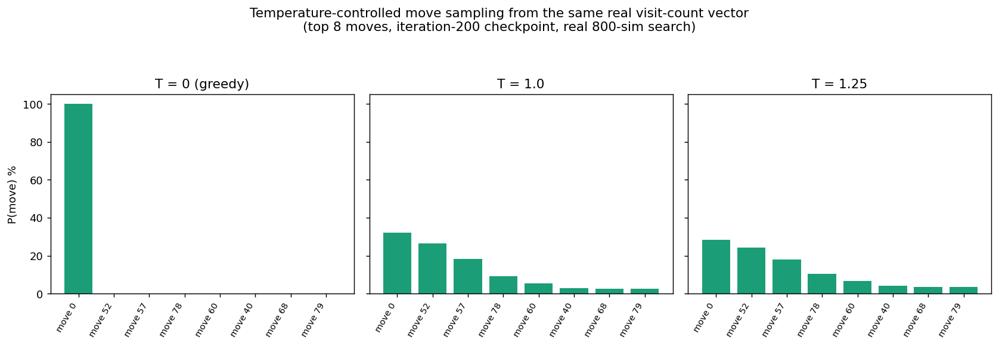
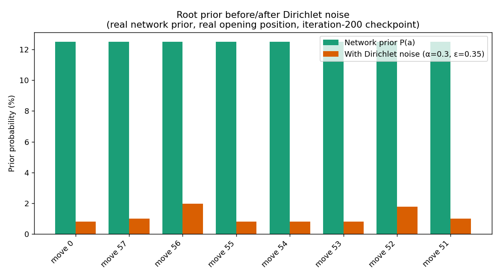

# From Zero to AlphaZero: Randomness by Design — Temperature, Noise, and the Self-Play Loop

Last essay was [Inside One MCTS Simulation — How AlphaZero Thinks Move by Move](https://tthl.substack.com/p/from-zero-to-alphazero-inside-one), which built the search tree: four phases, one simulation at a time, guided by PUCT. That tree ends in visit counts for each legal move, which leaves two questions unanswered: how do those visit counts turn into an actual move, and how do the resulting moves become training data for the network? This essay covers the two remaining components, temperature and Dirichlet noise, and shows how they combine with MCTS into the self-play training loop that makes AlphaZero work.

**Previous posts in this series:**

- [From Zero to AlphaZero: Ultimate Tic-Tac-Toe](https://tthl.substack.com/p/from-zero-to-alphazero-ultimate-tic)
- [From Zero to AlphaZero: Building the Ultimate Tic-Tac-Toe Engine in Python](https://tthl.substack.com/p/building-the-ultimate-tic-tac-toe)
- [From Zero to AlphaZero: The Reinforcement Learning Landscape](https://tthl.substack.com/p/from-zero-to-alphazero-the-reinforcement)
- [From Zero to AlphaZero: The Explore-Exploit Trade-off — The Bandit Algorithm Behind AlphaZero](https://tthl.substack.com/p/t3-the-slot-machine-problem-where)
- [From Zero to AlphaZero: PUCT — How AlphaZero Weighs Curiosity, Evidence, and Intuition](https://tthl.substack.com/p/from-zero-to-alphazero-puct-how-alphazero)
- *From Zero to AlphaZero: What Is a Computational Graph, Really?* (link TBD)
- *From Zero to AlphaZero: Teaching an Agent to Play — From Q-Tables to Deep Q-Networks* (draft)
- *From Zero to AlphaZero: Inside the Network — Convolutions, Batch Norm, and Global Pooling* (draft)
- *From Zero to AlphaZero: Inside One MCTS Simulation — How AlphaZero Thinks Move by Move* (draft)

---

## Temperature: Exploration vs Exploitation at Decision Time

After running 800 simulations, the naive answer for move selection is to pick the most visited move. That is correct during evaluation, when the goal is to see the network's actual best play, but wrong during training: always playing the top move produces identical self-play games, an extremely narrow distribution of board positions, and a network that never learns to handle positions deviating from its own favoured lines.

The solution is temperature-controlled sampling. Given visit counts N(a) for each legal move, we sample from:

$$\pi(a) = \frac{N(a)^{1/T}}{\sum_{a'} N(a')^{1/T}}$$

where T is the temperature parameter.

T = 0 (greedy): always pick the most visited move, completely deterministic, used during arena evaluation.

T = 1.0: sample proportional to visit counts, so if MCTS gave 450 visits to move A and 350 to move B, move A gets picked about 56% of the time, introducing significant randomness.

T = 1.25: the exponent 1/1.25 = 0.8 compresses differences between visit counts, so moves with 450 and 350 visits get closer to equal probability, producing more randomness and more diverse games.

The schedule during self-play uses T = 1.25 for the first thirty or so moves, covering the opening and early midgame where many lines are roughly equivalent, then switches to T = 0 for the late game, since the opening benefits from exploration while the endgame should play to win.

Temperature is the coarsest tool for diversity. It softens the gap between the best and second-best moves, but it cannot force MCTS to seriously explore a move the network has nearly ignored, which is where Dirichlet noise comes in.

## Dirichlet Noise: The Insurance Policy Against Fixation

Suppose the network assigns 90% prior probability to one move. MCTS will allocate most of its 800 simulations to that move, leaving the other moves roughly 11 simulations each, not enough to genuinely evaluate any of them.

That is fine if the network happens to be right, but early in training it usually is not, and committing almost all simulations to one path means accepting its initial judgment without ever interrogating the alternatives. In the worst case, a blind spot in the prior leads to a blind spot in the search, which reinforces the prior in training, which in turn deepens the blind spot, a fixation loop with no way to break out of it on its own.

The fix is Dirichlet noise, a random perturbation added to the prior at the root node:

$$P_{\text{noisy}}(a) = (1 - \varepsilon) \cdot P(a) + \varepsilon \cdot \text{Dir}(\alpha)$$

where Dir(α) is a draw from the Dirichlet distribution with concentration parameter α.

We use α = 0.3 and ε = 0.35: 35% of the prior comes from noise and 65% from the network. Even when the network is confident, MCTS still allocates meaningful simulations to alternatives.

Two choices are worth explaining.

Noise is added only at the root: deeper nodes are left unperturbed, so the diversity is concentrated at the move actually being played, without corrupting the evaluation of what follows. Adding noise at every node would simulate near-random play throughout the tree, defeating the purpose of the prior in the first place.

α = 0.3 produces spiky samples: a small α concentrates the noise's mass on a few moves unpredictably, rather than uniformly boosting every alternative, forcing MCTS to seriously weigh that particular subset in this one game without treating every move as equally worth exploring.

## From Simulations to Training Data

During self-play, every move in every game produces a training example. The process:

Step 1. Run 800 MCTS simulations from the current position (with Dirichlet noise at root).

Step 2. Record the visit distribution as the policy target:

$$\pi(a) = \frac{N(a)}{\sum_{a'} N(a')}$$

This tells the network what fraction of MCTS's attention went to each move, a refined version of what the raw prior said.

Step 3. Select the actual move via temperature sampling and play it.

Step 4. Continue until the game ends. Retroactively label every position in the game with z = +1 (current player won from that position), −1 (lost), or 0 (draw).

The training record for each position is the triple (state, π, z): the board position, what MCTS recommended, and what eventually happened.

## The Loss Function and the Feedback Loop

The network is trained to minimise:

$$L = -\sum_a \pi(a) \log p(a) + (z - v)^2$$

where the first term is the policy loss, matching MCTS visits, and the second is the value loss, matching the game outcome.

The policy loss (cross-entropy) pushes the network's prior toward the MCTS visit distribution. If MCTS concentrated 49% of its simulations on move A, the network learns to assign ~49% probability to that move.

The value loss (mean squared error) pushes the network's position estimate toward the actual game outcome. If the network said +0.3 but the game was lost, the loss pulls the estimate downward.

This works because MCTS is a better policy than the raw prior: it takes the network's prior as input, runs 800 focused simulations, and produces a refined estimate that accounts for actual game continuations. By training on MCTS visit distributions, the network is distilling the search process into its own weights.

After training, the prior is closer to what MCTS would have recommended, so the next MCTS round, using this improved prior, does better search, which produces better training targets, which in turn produces a better prior still. This self-reinforcing loop, in which search improves policy and policy improves search, is how AlphaZero begins at random play and converges on expert-level decisions.

The entropy of the visit distribution is a concrete measure of learning progress. Measured directly on this project's own checkpoints at the opening position, where all 81 cells are legal first moves, the maximum possible entropy is log(81) ≈ 4.39 nats, corresponding to a perfectly uniform policy. By iteration 5, the measured entropy is already close to that ceiling, at roughly 4.0 nats, and by iteration 200 it has fallen to roughly 2.78 nats, still well short of a fully deterministic policy.

