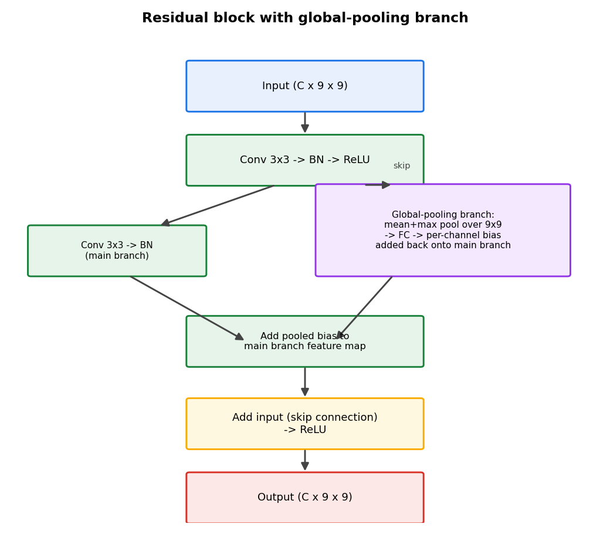
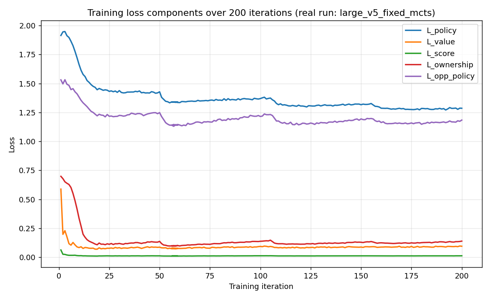
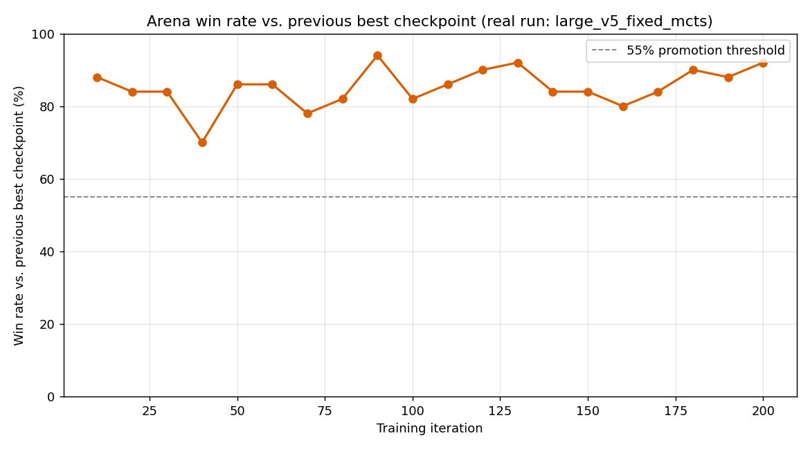
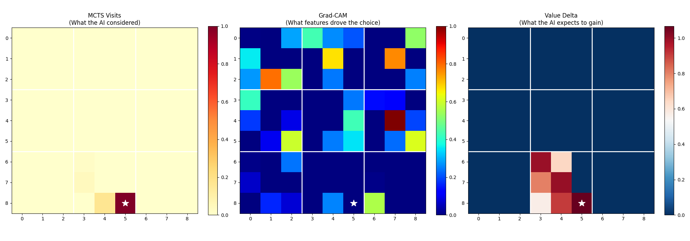
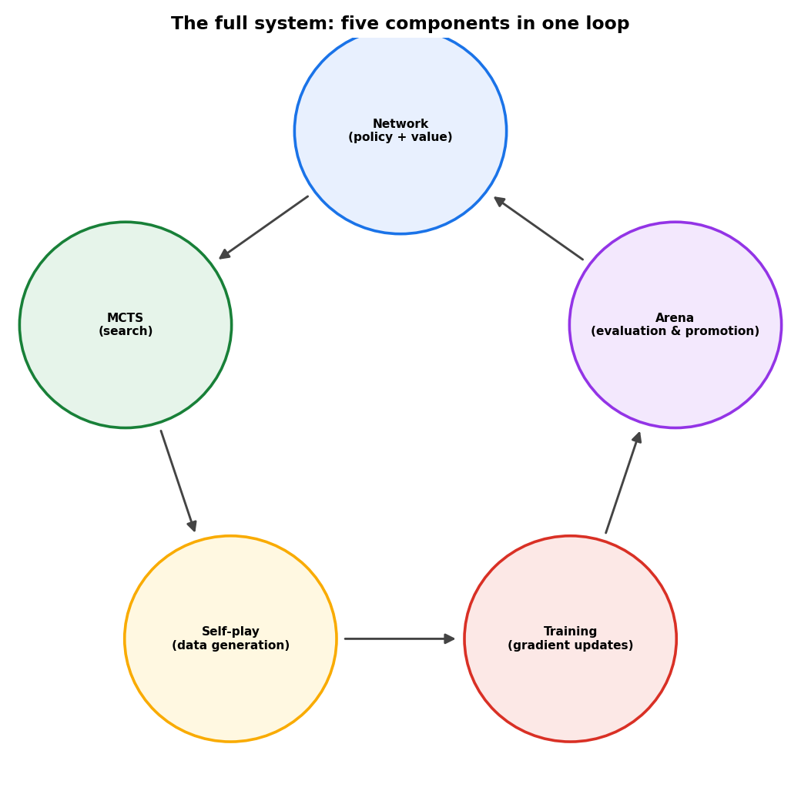

# From Zero to AlphaZero: The Full System — Network, MCTS, and Self-Play

Last essay was [Randomness by Design — Temperature, Noise, and the Self-Play Loop](https://tthl.substack.com/p/from-zero-to-alphazero-randomness), which closed out the search side of AlphaZero: MCTS, temperature, and Dirichlet noise, working together as one system. The motivation for building all of it goes back further, to the last practitioner posts, Teaching an Agent to Play Parts 1 and 2, where a tabular Q-agent (54% vs random) and a DQN (73.5% vs random) both plateaued. We diagnosed three failure modes:

1. **No lookahead**: both agents evaluate positions directly, with no tree search.
2. **Sparse rewards**: only the final game outcome provides a signal, and intermediate moves get nothing.
3. **Random opponent**: training against random play teaches the wrong lessons.

The full AlphaZero system fixes all three simultaneously, adding tree search (MCTS), dense supervision (policy targets from search, plus auxiliary value heads), and self-play. This post builds each piece and shows how they connect.

Everything here is code from `02_network/`, `03_mcts/`, `04_training/`.

**Previous posts in this series:**

- [From Zero to AlphaZero: Ultimate Tic-Tac-Toe](https://tthl.substack.com/p/from-zero-to-alphazero-ultimate-tic)
- [From Zero to AlphaZero: Building the Ultimate Tic-Tac-Toe Engine in Python](https://tthl.substack.com/p/building-the-ultimate-tic-tac-toe)
- [From Zero to AlphaZero: The Reinforcement Learning Landscape](https://tthl.substack.com/p/from-zero-to-alphazero-the-reinforcement)
- [From Zero to AlphaZero: The Explore-Exploit Trade-off — The Bandit Algorithm Behind AlphaZero](https://tthl.substack.com/p/t3-the-slot-machine-problem-where)
- [From Zero to AlphaZero: PUCT — How AlphaZero Weighs Curiosity, Evidence, and Intuition](https://tthl.substack.com/p/from-zero-to-alphazero-puct-how-alphazero)
- *From Zero to AlphaZero: What Is a Computational Graph, Really?* (link TBD)
- *From Zero to AlphaZero: Teaching an Agent to Play, Part 1 — Tabular Q-Learning* (draft)
- *From Zero to AlphaZero: Teaching an Agent to Play, Part 2 — Deep Q-Learning* (link TBD)
- *From Zero to AlphaZero: Inside the Network — Convolutions, Batch Norm, and Global Pooling* (draft)
- *From Zero to AlphaZero: Inside One MCTS Simulation — How AlphaZero Thinks Move by Move* (draft)
- *From Zero to AlphaZero: Randomness by Design — Temperature, Noise, and the Self-Play Loop* (draft)

---

## 1. The Board Encoding

Before the network can do anything, we need to convert a game state to a tensor. The encoder produces a `(7, 9, 9)` float32 tensor, seven channels over the 9×9 board:

```python
def encode_state(state: GameState) -> torch.Tensor:
    tensor = torch.zeros(7, 9, 9, dtype=torch.float32)
    cp = state.current_player  # 1 or -1

    # Channel 0: cells occupied by the current player
    # Channel 1: cells occupied by the opponent
    # Channel 2: valid cells (active sub-board mask)
    # Channel 3: sub-boards won by current player (all 9 cells marked)
    # Channel 4: sub-boards won by opponent
    # Channel 5: sub-boards that are drawn / dead
    # Channel 6: turn indicator (0.0 if P1, 1.0 if P2)
    ...
```

Two design choices are worth explaining here. The tensor is always from the current player's perspective, so channel 0 represents "my pieces" regardless of which colour is playing, which means the network only needs to learn one thing, how to win from the current position, rather than two separate policies. And channel 2 is the legal-move mask for this specific turn: the active sub-board constraint is baked in explicitly, so the network does not have to infer it.

---

## 2. The Network

### Residual trunk with global pooling

The central design decision is how to handle Ultimate TTT's *sending mechanic*, which creates long-range dependencies, since where a move sends the opponent depends on the entire board state. A plain convolutional net has a receptive field of roughly 5×5 after two layers, so it cannot see across the board.

The fix, borrowed from KataGo, is to add a global pooling branch inside every residual block:

```python
class ResidualBlock(nn.Module):
    def __init__(self, channels: int):
        super().__init__()
        self.conv1 = nn.Conv2d(channels, channels, kernel_size=3, padding=1, bias=False)
        self.bn1   = nn.BatchNorm2d(channels)
        self.conv2 = nn.Conv2d(channels, channels, kernel_size=3, padding=1, bias=False)
        self.bn2   = nn.BatchNorm2d(channels)

        # Global pooling MLP: channels -> channels//8 -> channels
        self.global_mlp = nn.Sequential(
            nn.Linear(channels, channels // 8),
            nn.ReLU(),
            nn.Linear(channels // 8, channels),
        )

    def forward(self, x: torch.Tensor) -> torch.Tensor:
        identity = x

        # Local branch: two 3x3 convs
        local = F.relu(self.bn1(self.conv1(x)))
        local = self.bn2(self.conv2(local))

        # Global branch: collapse all 81 positions to one vector
        pooled       = x.mean(dim=[2, 3])                              # (B, C)
        global_vec   = self.global_mlp(pooled)                         # (B, C)
        global_bcast = global_vec.unsqueeze(-1).unsqueeze(-1).expand_as(x)  # (B, C, 9, 9)

        # Combine: local features + global context + skip connection
        return F.relu(local + global_bcast + identity)
```



The key operation is `x.mean(dim=[2, 3])`, which collapses the entire (B, C, 9, 9) tensor to (B, C), a single vector summarising the whole board. This vector is transformed through a small MLP and broadcast back to every spatial position, so that after this step every cell carries information about what is happening everywhere else on the board. The skip connection (`+ identity`) makes deep stacks trainable.

### The two heads

After 8 residual blocks, the (B, 128, 9, 9) trunk features split:

```python
class UltimateTTTNetwork(nn.Module):
    def __init__(self, channels: int = 128, num_blocks: int = 8):
        super().__init__()
        self.input_conv = nn.Conv2d(7, channels, kernel_size=3, padding=1, bias=False)
        self.input_bn   = nn.BatchNorm2d(channels)
        self.trunk      = nn.Sequential(*[ResidualBlock(channels) for _ in range(num_blocks)])
        self.policy_head = PolicyHead(channels)
        self.value_head  = ValueHead(channels)

    def forward(self, x: torch.Tensor) -> NetworkOutput:
        h = F.relu(self.input_bn(self.input_conv(x)))  # (B, 7, 9, 9) -> (B, C, 9, 9)
        h = self.trunk(h)                               # 8 residual blocks
        policy_logits, opp_policy_logits = self.policy_head(h)
        value_out = self.value_head(h)
        return NetworkOutput(
            policy_logits=policy_logits,      # (B, 81) — raw move scores
            opp_policy_logits=opp_policy_logits,
            win_value=value_out.win_value,    # (B, 1) — tanh, [-1, 1]
            score_margin=value_out.score_margin,  # (B, 1) — auxiliary
            ownership=value_out.ownership,    # (B, 9) — per-sub-board
        )
```

**Policy head** produces 81 raw logits, one per board cell. During play, the softmax is taken over legal moves only, since illegal cells receive logit −∞ before the softmax is applied.

**Value head** produces three outputs. The main one, `win_value`, is a tanh-bounded estimate of win probability for the current player. Two auxiliary outputs, `score_margin` (how much the game is won or lost by) and `ownership` (which sub-boards each player controls), are training targets only; they are not used during play. They provide a richer gradient signal, since instead of one scalar per game, every position contributes twelve numbers to the loss.

The network has ~3.5M parameters. For reference, AlphaZero chess uses 20 blocks × 256 channels; 8 × 128 is sized for the simpler game.

---

## 3. MCTS Wired to the Network

### The node

Each MCTS node stores statistics for the actions below it:

```python
class MCTSNode:
    def __init__(self, state, parent=None, move_from_parent=None, prior=0.0):
        self.state = state
        self.parent = parent
        self.move_from_parent = move_from_parent
        self.prior = prior

        self.children: dict[int, MCTSNode] = {}
        self.N: dict[int, int]   = {}   # visit counts per action
        self.W: dict[int, float] = {}   # total value per action
        self.Q: dict[int, float] = {}   # mean value = W/N
        self.P: dict[int, float] = {}   # prior from network
        self.visit_count: int = 0
        self.is_expanded: bool = False
        self.is_terminal: bool = state.is_terminal
```

PUCT selection score:

```python
def puct_score(self, move_idx: int, c_puct: float = 1.0) -> float:
    q     = self.Q.get(move_idx, 0.0)
    prior = self.P.get(move_idx, 0.0)
    n_a   = self.N.get(move_idx, 0)
    n_s   = self.visit_count
    return q + c_puct * prior * math.sqrt(n_s) / (1 + n_a)
```

This is the AlphaZero PUCT formula. `Q(s,a)` is the empirical value from prior simulations, and the second term is an exploration bonus: it is large when `n_a` is small, an unexplored move, and scales with the network's prior `P(s,a)`. As a move gets visited more, its exploration bonus shrinks and its Q value comes to dominate.

Backup propagates the value up and *negates at each level*, because value is always from the current player's perspective:

```python
def backup(self, value: float) -> None:
    self.visit_count += 1
    if self.parent is not None and self.move_from_parent is not None:
        m = self.move_from_parent
        self.parent.N[m] = self.parent.N.get(m, 0) + 1
        self.parent.W[m] = self.parent.W.get(m, 0.0) - value  # negate!
        self.parent.Q[m] = self.parent.W[m] / self.parent.N[m]
        self.parent.backup(-value)  # negate again going up
```

### The search loop

```python
def run_mcts(
    root_state,
    network,
    num_simulations: int = 800,
    c_puct: float = 1.0,
    dirichlet_alpha: float = 0.3,
    dirichlet_epsilon: float = 0.35,
    device: str = 'cpu',
) -> MCTSNode:
    root = MCTSNode(state=root_state)

    # Expand root and add Dirichlet noise for exploration
    if not root.is_terminal:
        net_output  = network.predict(root_state, device=device)
        legal_moves = get_legal_moves(root_state)
        legal_mask  = get_legal_move_mask(root_state)
        probs       = apply_legal_mask(net_output.policy_logits, legal_mask)

        if dirichlet_epsilon > 0 and legal_moves:
            noise = np.random.dirichlet([dirichlet_alpha] * len(legal_moves))
            for i, move in enumerate(legal_moves):
                probs[move] = (1 - dirichlet_epsilon) * probs[move] + \
                               dirichlet_epsilon * noise[i]
            # Renormalize
            total = sum(probs[m].item() for m in legal_moves)
            if total > 0:
                for m in legal_moves:
                    probs[m] /= total

        root.expand(probs, legal_moves)

    # 800 simulations: select -> expand+evaluate -> backup
    for _ in range(num_simulations):
        node  = _select(root, c_puct)
        value = _expand_and_evaluate(node, network, device)
        node.backup(value)

    return root
```

Dirichlet noise is added only at the root, and only during self-play. It prevents the search from becoming deterministic, since without it the same opening position would always explore the same subtrees. `alpha=0.3` is borrowed from AlphaZero's chess configuration, and `epsilon=0.35` means 35% of the root's prior is random.

The expand-and-evaluate step uses the network's value directly, with no random rollout:

```python
def _expand_and_evaluate(node, network, device) -> float:
    if node.is_terminal:
        if node.state.winner is None or node.state.winner == 0:
            return 0.0
        return float(node.state.winner * node.state.current_player)

    net_output  = network.predict(node.state, device=device)
    legal_moves = get_legal_moves(node.state)
    probs       = apply_legal_mask(net_output.policy_logits,
                                   get_legal_move_mask(node.state))
    node.expand(probs, legal_moves)
    return net_output.win_value.item()
```

This is the crucial AlphaZero departure from classical MCTS. Original MCTS (pre-AlphaGo) played random games from the leaf to get a value estimate. AlphaZero replaces the rollout with a single network call, which is much faster and, once the network is trained, much more accurate.

### Move selection

After the 800 simulations, we pick a move:

```python
def select_move(root: MCTSNode, temperature: float = 1.0) -> int:
    visits = root.get_visit_counts()
    moves  = list(visits.keys())
    counts = np.array([visits[m] for m in moves], dtype=np.float64)

    if temperature == 0.0:
        return moves[np.argmax(counts)]  # greedy

    adjusted = counts ** (1.0 / temperature)
    probs    = adjusted / adjusted.sum()
    return int(np.random.choice(moves, p=probs))
```

Temperature = 1.0 samples proportional to visit counts, favouring exploration. Temperature = 0.0 always picks the most-visited move, favouring exploitation. In self-play, we use temperature 1.0 for the first thirty moves and 0.0 afterwards, which ensures diverse opening play while keeping the endgame precise.

---

## 4. Self-Play Data Generation

One self-play game generates every training example:

```python
def play_self_play_game(network, num_simulations=800, temperature_threshold=30,
                         device='cpu') -> GameRecord:
    state = create_initial_state()
    move_records: list[MoveRecord] = []

    while not state.is_terminal:
        root   = run_mcts(state, network, num_simulations=num_simulations, device=device)
        visits = root.get_visit_counts()

        # Policy target: normalized visit distribution over legal moves
        policy_tgt = compute_policy_target(visits, len(get_legal_moves(state)))

        temp = 1.0 if state.move_count < temperature_threshold else 0.0
        move = select_move(root, temperature=temp)

        move_records.append(MoveRecord(
            state_tensor=encode_state(state),
            policy_target=policy_tgt,        # MCTS visit distribution
            legal_mask=get_legal_move_mask(state),
            current_player=state.current_player,
            ...
        ))
        state = apply_move(state, move)

    # After game ends: label every position with outcome
    winner = state.winner if state.winner is not None else 0
    for rec in move_records:
        cp = rec.current_player
        # Anti-draw shaping: draw = -0.5 (not 0) to encourage risk-taking
        rec.value_target    = float(winner * cp) if winner != 0 else -0.5
        rec.score_target    = float(np.sum(final_results == cp) -
                                    np.sum(final_results == -cp)) / 9.0
        rec.ownership_target = torch.tensor(
            [(1.0 if final_results[i] == cp else 0.0) for i in range(9)]
        )
    return GameRecord(moves=move_records, winner=winner, game_length=len(move_records))
```

A few points are worth unpacking.

**Policy targets are search posteriors.** The policy head is trained to reproduce what MCTS concluded after 800 simulations, which is a refinement of the network's own prior belief obtained by searching ahead. Training the network to match MCTS output is how the network becomes smarter over successive iterations.

**Opponent policy target** is simply the next position's policy target, set in a second pass after the game ends. It trains an auxiliary head to predict the opponent's next move, which forces the trunk to maintain representations useful for both sides.

**Anti-draw shaping:** draws get `value_target = -0.5` instead of the more obvious 0. That penalises both players for a draw, pushing the network to prefer risky play in winning positions. Without this, agents can develop a bias toward draws as a "safe" outcome.

---

## 5. The Training Loop

### Configuration

```python
@dataclass
class TrainingConfig:
    # Self-play
    num_self_play:         int   = 10    # pure self-play games per iter
    num_vs_random:         int   = 5     # games vs random opponent
    num_vs_best:           int   = 5     # games vs best checkpoint
    num_simulations:       int   = 800   # MCTS calls per move
    temperature_threshold: int   = 30    # moves before greedy selection

    # Training
    batch_size:            int   = 256
    batches_per_iteration: int   = 100
    learning_rate:         float = 0.001
    weight_decay:          float = 1e-4
    grad_clip_norm:        float = 1.0
    lr_decay_every_n:      int   = 50
    lr_decay_gamma:        float = 0.5

    # Loss weights
    lambda_value:          float = 1.0
    lambda_score:          float = 0.5
    lambda_ownership:      float = 0.5
    lambda_opp:            float = 0.15

    # Evaluation
    arena_every_n:         int   = 10
    arena_games:           int   = 100
    win_rate_threshold:    float = 0.55  # must beat best by 55% to become new best

    # Buffer
    buffer_capacity:       int   = 500_000  # circular, ~30k games
```

The mixed self-play batch (10 pure self-play + 5 vs random + 5 vs best) serves two purposes. Games vs random fill the buffer quickly in early training when the network is weak. Games vs best checkpoint maintain competitive pressure after the network improves.

### The loss function

Five components update simultaneously:

```python
def compute_total_loss(output, batch, lambda_value=1.0, lambda_score=0.5,
                        lambda_ownership=0.5, lambda_opp=0.15) -> LossBreakdown:
    # L_policy: cross-entropy vs MCTS visit distribution
    masked_logits = output.policy_logits.masked_fill(~batch.legal_masks.bool(), float('-inf'))
    log_probs = F.log_softmax(masked_logits, dim=-1)
    L_policy  = -(batch.policy_targets * log_probs).sum(dim=-1).mean()

    # L_value: MSE vs game outcome
    L_value = F.mse_loss(output.win_value.squeeze(-1), batch.value_targets.squeeze(-1))

    # L_score: MSE vs normalized score margin
    L_score = F.mse_loss(output.score_margin.squeeze(-1), batch.score_targets.squeeze(-1))

    # L_ownership: binary cross-entropy vs sub-board outcome
    L_ownership = F.binary_cross_entropy(output.ownership, batch.ownership_targets)

    # L_opp: auxiliary opponent policy (same form as L_policy)
    opp_logits = output.opp_policy_logits.masked_fill(~batch.opp_legal_masks.bool(), float('-inf'))
    opp_log    = F.log_softmax(opp_logits, dim=-1)
    L_opp      = -(batch.opp_policy_targets * opp_log).sum(dim=-1).mean()

    total = L_policy + lambda_value * L_value + lambda_score * L_score + \
            lambda_ownership * L_ownership + lambda_opp * L_opp

    return LossBreakdown(total=total, policy=L_policy, value=L_value,
                          score=L_score, ownership=L_ownership, opp_policy=L_opp)
```

Five losses do more work than one would, because each game generates only one win or loss signal but many positions. Score margin and ownership give every position richer signal: how much the game was won or lost by, and which parts of the board each player controlled. The opponent policy loss acts as regularisation, preventing the shared trunk from becoming too asymmetric.

### One training iteration

```python
def train(config: TrainingConfig) -> None:
    network   = UltimateTTTNetwork(channels=config.channels, num_blocks=config.num_blocks)
    optimizer = torch.optim.Adam(network.parameters(), lr=config.learning_rate,
                                  weight_decay=config.weight_decay)
    scheduler = torch.optim.lr_scheduler.StepLR(optimizer, step_size=config.lr_decay_every_n,
                                                  gamma=config.lr_decay_gamma)
    buffer    = ReplayBuffer(capacity=config.buffer_capacity)

    while True:
        # 1. Self-play: generate new positions
        network.eval()
        records = generate_mixed_batch(network, ...)
        for record in records:
            buffer.add_game(record)

        # 2. Train on random samples from buffer
        network.train()
        for _ in range(config.batches_per_iteration):
            batch = buffer.sample(config.batch_size)
            output = network(batch.state_tensors)
            loss   = compute_total_loss(output, batch, ...)
            optimizer.zero_grad()
            loss.total.backward()
            nn.utils.clip_grad_norm_(network.parameters(), config.grad_clip_norm)
            optimizer.step()

        # 3. Evaluate vs random (every 10 iters)
        if iteration % config.arena_every_n == 0:
            win_rate = evaluate_vs_random(network, num_games=50)
            if win_rate > 0.55 and win_rate > best_random_win_rate:
                save_checkpoint(network, optimizer, iteration, win_rate, ...)
                best_random_win_rate = win_rate

        scheduler.step()
```

Gradient clipping (`max_norm=1.0`) is a cheap insurance policy: it prevents any catastrophic single update when the loss landscape is steep, which can happen early in training when the network is learning fast.

The replay buffer is circular with capacity 500,000 positions, about 30,000 games. As newer, stronger games arrive, they overwrite the oldest. The buffer provides diversity, since it holds positions from many different games rather than only the most recent ones, and stability, since training does not overfit to the latest style of play.

---

## 6. What Healthy Training Looks Like

The trainer prints diagnostics at the end of each iteration. Here is what to watch:

| Loss | Starting value | Healthy progress | Warning sign |
|------|---------------|-----------------|--------------|
| L_policy | ~4.4 (log 81) | Steady decrease | Plateau before iter 50 |
| L_value | ~0.5–1.0 | Slow, noisy decrease | Wild oscillation |
| L_score | ~0.3–0.5 | Tracks L_value | Moving opposite to L_value |
| L_ownership | ~0.6–0.7 | Fast early drop | Not moving |
| L_opp | ~4.4 | Tracks L_policy | Diverging from L_policy |

L_policy starts at roughly 4.4 because that is `log(81)`: the network initially knows nothing and assigns equal probability to all moves. As it learns from MCTS targets, this value drops.

L_ownership drops fastest of all losses in early training, since ownership is the simplest target: the network can quickly learn that cells currently controlled by the current player are more likely to remain theirs. This fast early signal bootstraps the shared trunk, which then benefits the harder value and policy predictions.

Common failure modes and fixes:

**L_policy stops decreasing before iteration 50**: MCTS is not improving yet. Check that Dirichlet noise is enabled (`dirichlet_epsilon > 0`), since without noise MCTS explores the same subtrees repeatedly.

**L_value stuck at ~1.0**: Check the sign convention. Value targets should be `+1` for wins and `−1` for losses from the current player's perspective. Getting the perspective flip wrong means the network is trying to predict the *wrong player's* outcome.

**Policy entropy collapses to 0**: The network has committed to one move everywhere. Usually caused by too-high learning rate, or training for too many steps on too small a buffer. Reduce `lr` or increase `buffer_capacity`.

---

## 7. Results

Training ran for 200 iterations, roughly 4,000 self-play games in total, drawn from the `large_v5_fixed_mcts` checkpoint run and its saved training log. Two real signals from that log are worth walking through carefully, because one of them is easy to misread.



The loss curves match the pattern described in the previous section: L_ownership falls fastest, L_policy and L_opp_policy fall together and more slowly, and L_value and L_score decline more gradually while tracking each other throughout the run.

The second signal is the arena win rate, the metric that actually gates promotion to a new best checkpoint, and it is worth being precise about what this number measures. Every ten iterations, the newest candidate network plays a batch of games against the current best checkpoint, and if it wins at least 55% of them, it replaces that checkpoint as the new best. This is a win rate against the previous best network, not against a random opponent.



Read this way, the real numbers make sense. The arena win rate hovers between roughly 70% and 94% throughout the run and closes at 92% by iteration 200, rather than climbing steadily from a low starting point toward a plateau. That is exactly the shape to expect from a promotion-gated metric: every checkpoint that clears the bar becomes the new baseline the next candidate is measured against, so the recorded win rate stays compressed into a similar range even as the network's absolute strength keeps improving underneath it. A direct measurement of strength against a fixed random opponent, tracked across the same run, would likely show a steadier climb, but no such log was kept for this training run, so that comparison is left as a natural follow-up rather than a claim made without the data to support it.

The most visible qualitative change between early and late training is that the agent learns to force the opponent into a corner. Early agents play reasonable local moves. Later agents make moves that send the opponent to a sub-board where every available response sends them somewhere even worse. This multi-move constraint exploitation, exactly the kind of non-local reasoning the global pooling architecture was designed to support, emerges purely from self-play, with no explicit instruction.

The figure below makes this concrete for one real position, taken from a trained checkpoint: the MCTS visit distribution, a Grad-CAM saliency map over the input channels, and the network's value-delta estimate, all computed for the same chosen move.



---

## Putting It Together

The full system has five components that depend on each other in a cycle:

1. **Encoder** (`encode_state`) converts a game state to (7, 9, 9).
2. **Network** (residual trunk, global pooling, dual heads) converts (7, 9, 9) to policy logits and a value estimate.
3. **MCTS** (`run_mcts`) uses the network's policy and value to build a partial game tree, producing better move scores than the raw network alone.
4. **Self-play** (`play_self_play_game`) generates labelled positions using MCTS scores as targets.
5. **Training loop** updates the network on those positions, improving the network used in step 3.



Each component improves the next: a stronger network produces better MCTS targets, which produce better training data, which produces a stronger network in turn.

None of the three pieces does much on its own. The residual blocks with global pooling give the network something to reason about the sending mechanic with, but a network alone still has no lookahead. MCTS supplies the lookahead, but it is only as good as the prior guiding it. Self-play is what keeps that prior improving, iteration after iteration, without anyone hand-labelling a single position.
